# 🔐 Optimizing SSL/TLS Certificates for Nginx & Postfix

> **Author:** Sammy Roy · **Cohort:** MEQ7 · **Team:** Team 3  
> **Domain:** `gwallofchina.yulcyberhub.click` · **Due:** April 2, 2026


---

## 👥 Team Contributions

| Team Member | Role | Key Contributions |
|---|---|---|
| **Sammy Roy** | Infrastructure Lead | SSL/TLS configuration (Nginx + Postfix/Dovecot) · DNSSEC implementation & setup (KMS CMK, KSK, zone signing) · DNS record architecture (18 records) · Certificate hardening · Security headers · Cipher suite selection · Automated verification scripts · Full documentation (60 screenshots) |
| **Paulo Borelli** | IAM & Automation Lead | AWS CLI setup documentation · AWS SSO authentication guide (eliminate static credentials) · IAM hardening policies (Instance-Based Access Control + Machine Identity profiles) · S3 anti-ransomware guardrails · `launch-instance.sh` EC2 launch automation script · IMDSv2 enforcement (`HttpTokens=required`) against SSRF |
| **Keeshon Bain** | Architecture & Consulting | Deployment-flow restructure (CLI → DNS → EC2 → Nginx → Postfix) · Technical consulting across all phases |
| **Marc-Olivier Hélie** | Documentation | Assignment reflection · Screenshot documentation |

---

## 📋 Table of Contents

- [Executive Summary](#executive-summary)
- [Architecture Overview](#architecture-overview)
- [Phase 1 — AWS CLI & Credential Security](#phase-1--aws-cli--credential-security)
  - [1.1 Threat Model](#11-threat-model)
  - [1.2 Secure Alternatives: SSO vs. aws-vault](#12-secure-alternatives-sso-vs-aws-vault)
  - [1.3 aws-vault — Encrypted Keyring Credentials](#13-aws-vault--encrypted-keyring-credentials)
  - [1.4 AWS SSO — Non-Persistent Sessions (Step-by-Step)](#14-aws-sso--non-persistent-sessions-step-by-step)
- [Phase 2 — DNS Infrastructure](#phase-2--dns-infrastructure)
  - [2.1 Creating the Hosted Zone](#21-creating-the-hosted-zone)
  - [2.2 DNS Record Architecture](#22-dns-record-architecture)
  - [2.3 DNSSEC Implementation](#23-dnssec-implementation)
- [Phase 3 — EC2 Instance & Security Groups](#phase-3--ec2-instance--security-groups)
  - [3.1 Instance Launch Script](#31-instance-launch-script)
  - [3.2 Deployed Instance Configuration](#32-deployed-instance-configuration)
  - [3.3 Security Group Rules](#33-security-group-rules)
- [Phase 4 — Nginx Web Server Hardening](#phase-4--nginx-web-server-hardening)
  - [4.1 SSL Certificate Choice](#41-ssl-certificate-choice)
  - [4.2 Protocol Selection](#42-protocol-selection)
  - [4.3 Cipher Suites](#43-cipher-suites)
  - [4.4 Perfect Forward Secrecy (PFS)](#44-perfect-forward-secrecy-pfs)
  - [4.5 HTTP Strict Transport Security (HSTS) & Security Headers](#45-http-strict-transport-security-hsts--security-headers)
  - [4.6 Service Hardening](#46-service-hardening)
  - [4.7 Verification](#47-verification)
- [Phase 5 — Mail Server Hardening (Postfix & Dovecot)](#phase-5--mail-server-hardening-postfix--dovecot)
  - [5.1 SSL Certificate Choice](#51-ssl-certificate-choice)
  - [5.2 Installation](#52-installation)
  - [5.3 Protocol Selection](#53-protocol-selection)
  - [5.4 Cipher Suites & Inbound TLS Hardening](#54-cipher-suites--inbound-tls-hardening)
  - [5.5 SMTP Authentication — The Secret Pipe](#55-smtp-authentication--the-secret-pipe)
  - [5.5.1 OpenDKIM — Local DKIM Signing](#551-opendkim--local-dkim-signing)
  - [5.6 Virtual Mailbox Configuration](#56-virtual-mailbox-configuration)
  - [5.7 Inbound Mail — Direct SMTP Reception](#57-inbound-mail--direct-smtp-reception)
  - [5.8 Webmail Application](#58-webmail-application)
  - [5.9 SPF / DKIM / DMARC / MTA-STS](#59-spf--dkim--dmarc--mta-sts)
  - [5.10 Adding a New User](#510-adding-a-new-user)
  - [5.11 Client Mail App Settings](#511-client-mail-app-settings)
  - [5.12 Sendgrid Fallback, webmail, final configurations](https://github.com/mrblue223/CyberSecurity_School_Labs/blob/main/Optimizing_SSL_Certificates/README.md#512-sendgrid-fallback-mechanisms-webmail-interactions-and-final-configuration-files)
  - [5.13 Verification](#512-verification)
- [Phase 6 — Challenges & Trade-Offs](#phase-6--challenges--trade-offs)
  - [6.1 Security vs. Compatibility](#61-security-vs-compatibility)
  - [6.2 Performance Considerations](#62-performance-considerations)
  - [6.3 Testing & Troubleshooting](#63-testing--troubleshooting)
- [References](#references)

---

## Executive Summary

This document is a comprehensive technical reflection on the **"Great Wall"** hardened SSL/TLS infrastructure project. The deployment follows a structured sequence: AWS credentials → DNS → EC2 → Nginx → Postfix/Dovecot. The project achieved **A+ ratings on SSL Labs for both web and mail services**, implementing zero-trust principles, modern cryptography, and defense-in-depth strategies across every layer.

| Component | Rating | Key Achievement |
|---|---|---|
| Web Server (Nginx) |  | TLS 1.3 · HSTS Preload · OCSP Stapling |
| Mail Server (Postfix/Dovecot) |  | SMTPS/IMAPS · SPF/DKIM/DMARC · MTA-STS |
| Certificate Score | 100/100 | Let's Encrypt SAN cert (ISRG Root X1) |
| Protocol Score | 100/100 | TLS 1.2 + 1.3 only; all legacy disabled |
| Key Exchange Score | 100/100 | ECDHE/DHE with 4096-bit DH params |
| Cipher Strength Score | 100/100 | AEAD-only suites (AES-GCM, ChaCha20) |

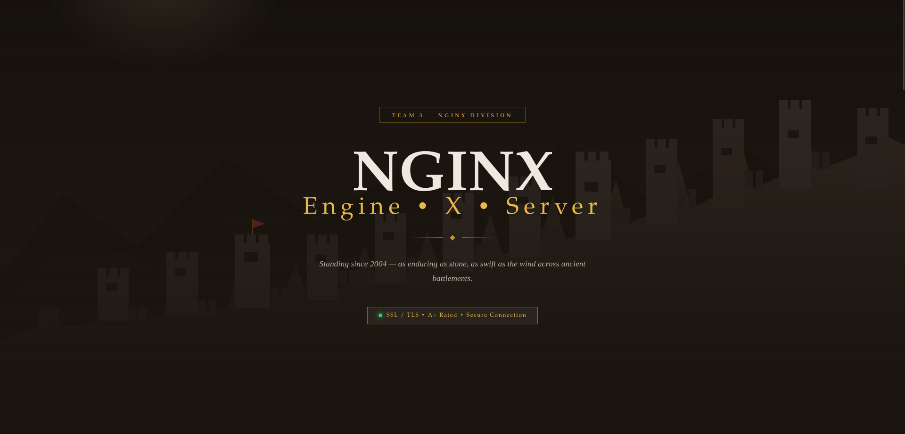
*The "Great Wall" live Nginx landing page — Team 3, NGINX Division. SSL / TLS · A+ Rated · Secure Connection.*

---

## Architecture Overview

```
Internet
    │
    ▼
Route 53 (DNS · MX → mail.gwallofchina.yulcyberhub.click)
    │
    ▼
AWS Security Group (Ports 25, 80, 443, 465, 587, 993)
    │
    ▼
EC2 Instance (Elastic IP: 54.226.198.180)
  ├── Nginx (Reverse Proxy — Port 443)
  │     ├── gwallofchina.yulcyberhub.click       → /var/www/html (castle page)
  │     ├── mail.gwallofchina.yulcyberhub.click  → Node.js :3000 (webmail)
  │     └── mta-sts.gwallofchina.yulcyberhub.click → /var/www/mta-sts (policy file)
  ├── Postfix (SMTP — Ports 25 inbound · 465 SMTPS · 587 submission)
  ├── OpenDKIM (DKIM milter — Port 8891 · signs all outbound mail)
  ├── Dovecot (IMAP — Port 993)
  ├── Node.js Webmail App (Internal — Port 3000)
  └── EBS Volume (/var/mail/vhosts)
    │
    ▼ (Inbound Mail — directly to Postfix port 25)
Sender MTA → MX lookup → mail.gwallofchina.yulcyberhub.click:25
    │
    ▼ (Outbound Mail — PRIMARY)
Direct SMTP to Recipient MX Servers (Port 25 · MX lookup · OpenDKIM signed)
    │
    ▼ (Outbound Mail — FALLBACK, activates only if direct delivery fails)
SendGrid Relay (Port 587 · STARTTLS)
    │
    ▼
Recipient Mail Servers
```

> **Note on inbound mail:** The MX record points directly to `mail.gwallofchina.yulcyberhub.click` (EC2 instance). Postfix receives inbound mail directly on port 25. Port 25 is open in the AWS security group and unblocked at the account level by Oracle (instructor).

> **Note on outbound mail:** Postfix is configured with an empty `relayhost` (direct delivery via MX lookup) as the **primary** path. All outbound mail is signed by OpenDKIM before leaving the server. `fallback_relay = [smtp.sendgrid.net]:587` activates automatically only when direct delivery fails.

---

## Phase 1 — AWS CLI & Credential Security

### 1.1 Threat Model

Running `aws configure` stores long-lived access keys in plaintext under `~/.aws/credentials`. If that file is compromised:

- The attacker gains **persistent** AWS access with no expiration
- No automatic revocation or detection
- High risk of full account takeover

Two complementary solutions were implemented to eliminate this attack surface entirely.

### 1.2 Secure Alternatives: SSO vs. aws-vault

| Approach | Mechanism | When Used |
|---|---|---|
| **AWS SSO** (primary) | Short-lived credentials via browser authentication | All lab CLI operations against the organizational account |
| **aws-vault** (alternative) | Stores secrets in OS keystore + generates ephemeral STS sessions | Workstation-level credential isolation for automation |

### 1.3 aws-vault — Encrypted Keyring Credentials

[aws-vault (ByteNess fork)](https://github.com/ByteNess/aws-vault) wraps the AWS CLI and stores the underlying access keys in the OS-level keyring (GNOME Keyring / KWallet / macOS Keychain) rather than plaintext on disk. It injects temporary STS credentials into a subshell, scoped to that process only.

```bash
# Store credentials in the encrypted OS keyring — never touches ~/.aws/credentials
aws-vault add meq7-secure-profile

# Execute any AWS CLI command inside a subshell with temporary STS tokens
aws-vault exec meq7-secure-profile -- aws s3 ls
```

**Security properties:**

| Property | Mechanism |
|---|---|
| Keys encrypted at rest | OS keyring (GNOME Keyring / KWallet / macOS Keychain) |
| No plaintext on disk | Credentials never written to `~/.aws/credentials` |
| Subshell isolation | Credential scope limited to the child process |
| Automatic memory clearing | Tokens purged on process termination |
| Short-lived tokens | STS `AssumeRole` generates time-limited credentials per call |

### 1.4 AWS SSO — Non-Persistent Sessions (Step-by-Step)

#### Prerequisites

- AWS CLI v2 installed
- Access to the SSO portal: `https://d-90660512c9.awsapps.com/start`
- SSO region and role access provided by the instructor

#### Step 1 — Clean Existing AWS Config

Before configuring SSO, any stale credentials, config files, or cached SSO tokens are removed to ensure a clean state and prevent conflicts with the new session:

```bash
rm -rf ~/.aws/credentials ~/.aws/config ~/.aws/sso
ls ~/.aws/
```

#### Step 2 — Run the SSO Configuration Wizard

```bash
aws configure sso
```

The wizard was filled in with the following values:

| Prompt | Value |
|---|---|
| Session name | `meq7` |
| SSO Start URL | `https://d-90660512c9.awsapps.com/start` |
| SSO Region | `us-east-1` |
| Scope | `sso:account:access` |
| Output format | `json` |
| Profile name | `meq7` |

#### Step 3 — Browser Authentication

The CLI opens a browser automatically. The team clicked **Allow access** and selected:

- **Account:** `453875232433` (YulCyberClick Demo)
- **Role:** `MEQ7_RBAC_Room3`

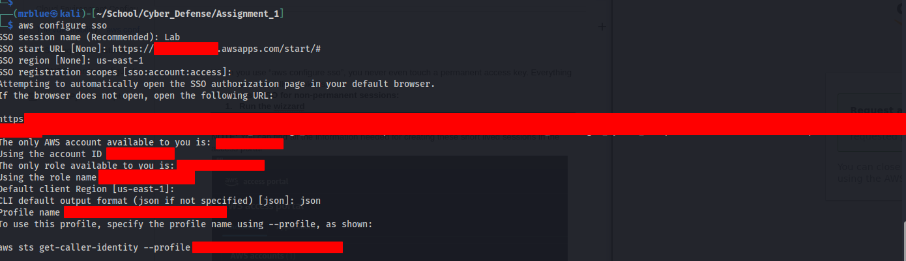
*`aws configure sso` — SSO session name "meq7", region `us-east-1`. The CLI automatically detected the single available account (`YulCyberClick Demo`, 453875232433) and role (`MEQ7_RBAC_Room3`). SSO URL redacted.*

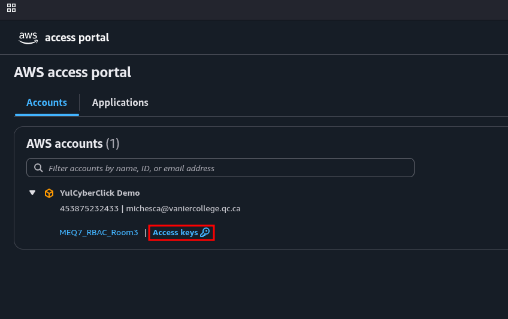
*AWS Access Portal — `YulCyberClick Demo` account under `MEQ7_RBAC_Room3`. The **"Access keys"** link generates temporary STS credentials on demand — no permanent IAM user keys exist at any point.*

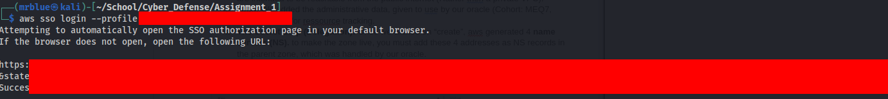
*`aws sso login --profile meq7` — successful browser-based SSO authentication. Profile name and SSO URL redacted for operational security.*

#### Step 4 — Verify the Connection

```bash
aws sts get-caller-identity --profile meq7
```

Expected output — confirms account access without permanent keys:

```json
{
  "Account": "453875232433"
}
```

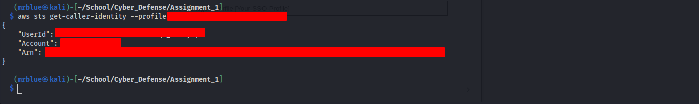
*`aws sts get-caller-identity --profile meq7` — confirms the active session is a temporary STS assumed-role token, not a permanent IAM key. The ARN format `arn:aws:sts::ACCOUNT:assumed-role/...` is the proof — a permanent key would return `arn:aws:iam::ACCOUNT:user/USERNAME`. UserId, Account, and ARN redacted.*

#### Daily Usage

```bash
# Start of each session
aws sso login --profile meq7

# Verify active identity
aws sts get-caller-identity --profile meq7

# End of session
aws sso logout
```

**Why this matters:** If the Kali workstation were compromised, an attacker would find no extractable AWS keys in `~/.aws/credentials` — only encrypted keyring entries (aws-vault) or expired SSO cache tokens. This directly mitigates the most common AWS credential compromise vector: credential file theft.

---

## Phase 2 — DNS Infrastructure

### 2.1 Creating the Hosted Zone

A public Route 53 hosted zone was created as the DNS container for the domain. Once created, AWS auto-generated four name servers (NS records) which were provided to the Oracle (instructor) to establish delegation from the parent zone `yulcyberhub.click`.

```bash
aws route53 list-hosted-zones \
    --query 'HostedZones[?Name==`gwallofchina.yulcyberhub.click.`].[Id, Name, Config.PrivateZone]' \
    --output table
```

| Field | Value |
|---|---|
| Zone ID | `Z0433076DMIP84BGAZGN` |
| Domain | `gwallofchina.yulcyberhub.click.` |
| Type | Public (`PrivateZone: False`) |

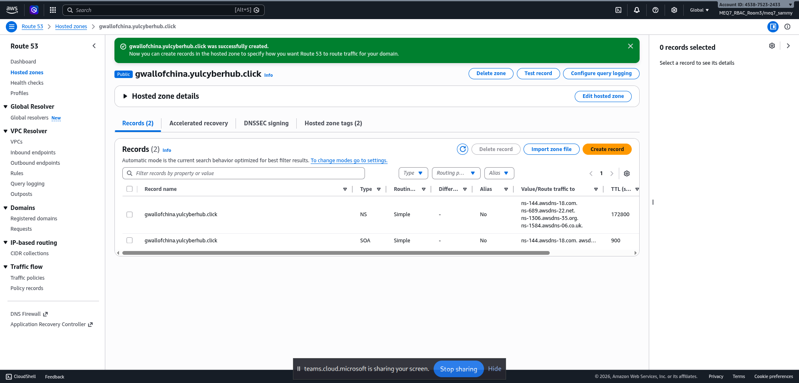
*Green success banner: **"gwallofchina.yulcyberhub.click was successfully created."** The zone starts with 2 records (NS + SOA). The four AWS name servers visible (`ns-144.awsdns-18.com`, `ns-689.awsdns-22.net`, `ns-1306.awsdns-35.org`, `ns-1584.awsdns-06.co.uk`) were handed to the Oracle to complete DNS delegation.*

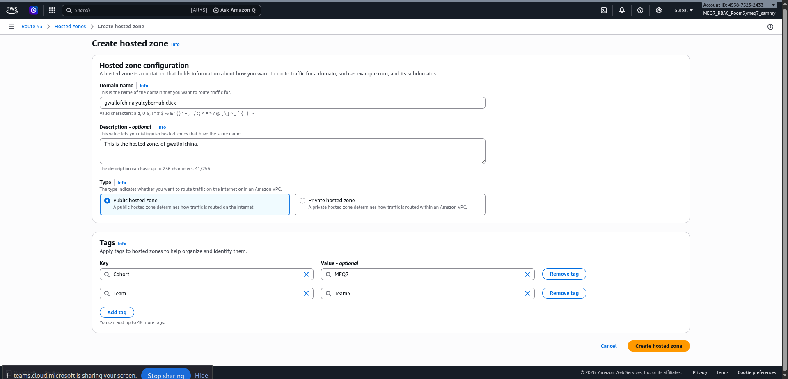
*AWS Route 53 "Create hosted zone" form — domain `gwallofchina.yulcyberhub.click`, type: **Public Hosted Zone**, tags: Cohort=MEQ7, Team=Team3.*

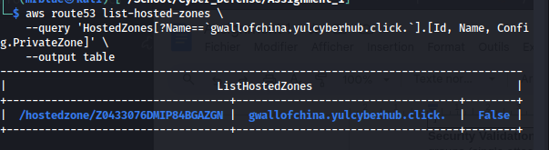
*`aws route53 list-hosted-zones` — confirms Zone ID `Z0433076DMIP84BGAZGN`, domain `gwallofchina.yulcyberhub.click.`, `PrivateZone: False` — publicly resolvable on the internet.*

---

### 2.2 DNS Record Architecture

The final hosted zone contains 23 records covering all required services and security mechanisms.

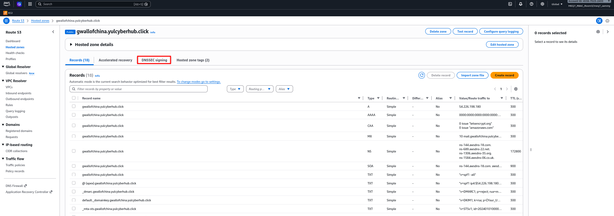
*AWS Route 53 hosted zone — all 18 DNS records visible: A, AAAA, CAA, MX, NS, SOA, TXT (SPF, DMARC, DKIM, MTA-STS), SRV, and CNAME records.*

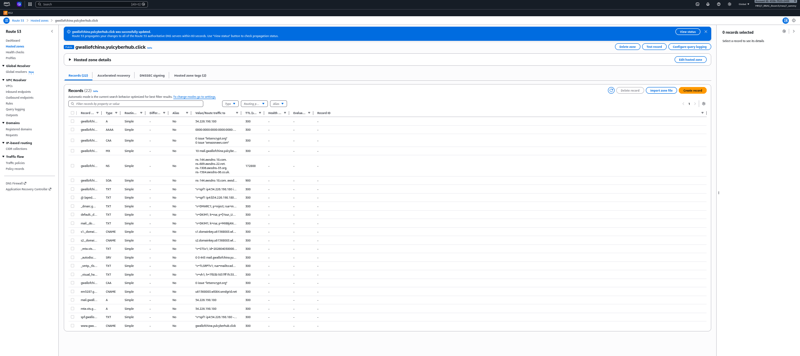
*All records after complete configurations)

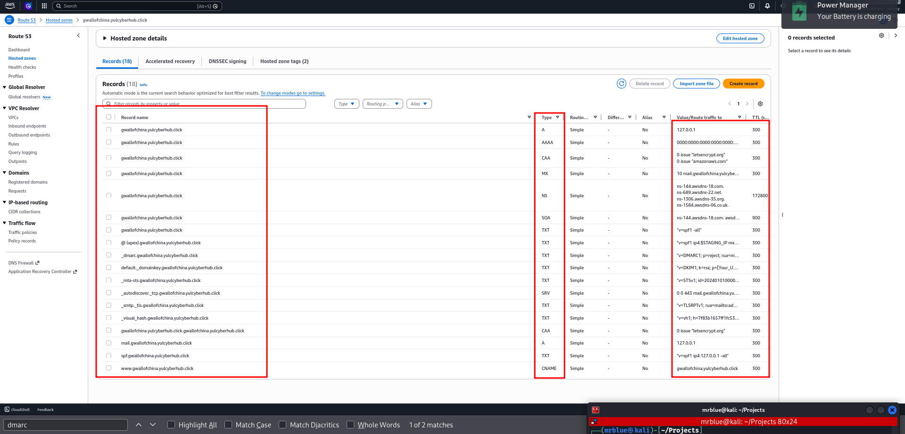
*Full record list with values: A (`54.226.198.180`), CAA (`letsencrypt.org` + `amazonaws.com`), MX (`10 mail.*`), NS (four AWS servers), SPF (`v=spf1 ip4:54.226.198.180 mx -all`), DMARC (`p=reject`), DKIM, MTA-STS, `_smtp._tls`, `_visual_hash`, `_autodiscover._tcp` SRV, `mail.` A record, and `www.` CNAME.*

**Foundation Records:**

| Record | Type | Value | Purpose |
|---|---|---|---|
| `@` | A | 54.226.198.180 | IPv4 entry point |
| `@` | AAAA | `::0` | IPv6 placeholder (future) |
| `www` | CNAME | `gwallofchina.yulcyberhub.click` | Canonical alias |
| `mail` | A | 54.226.198.180 | Mail host (MX target) |
| `mta-sts` | A | 54.226.198.180 | MTA-STS policy file host |

**CA Authorization Records:**

```dns
@ CAA 0 issue "letsencrypt.org"
@ CAA 0 issue "amazonaws.com"
```

CAA records restrict certificate issuance to Let's Encrypt only — preventing rogue CA issuance and shadow IT certificate creation.

**Email Security Records:**

| Record | Type | Value | Mechanism |
|---|---|---|---|
| `@` | MX | `10 mail.gwallofchina.yulcyberhub.click` | Direct inbound mail to EC2 server |
| `@` | TXT | `v=spf1 ip4:54.226.198.180 include:sendgrid.net mx ~all` | SPF — authorizes EC2 IP + SendGrid fallback |
| `_dmarc` | TXT | `v=DMARC1; p=reject; ...` | Reject spoofed mail |
| `mail._domainkey` | TXT | `v=DKIM1; k=rsa; p=...` | Local DKIM signing via OpenDKIM (direct send) |
| `s1._domainkey` | CNAME | SendGrid DKIM endpoint | Auto-rotating DKIM (SendGrid fallback) |
| `s2._domainkey` | CNAME | SendGrid DKIM endpoint | Redundant DKIM (SendGrid fallback) |
| `_mta-sts` | TXT | `v=STSv1; id=20260403000000` | SMTP TLS enforcement |
| `_smtp._tls` | TXT | `v=TLSRPTv1; rua=...` | TLS failure reporting |

> **Critical:** The MX record now points directly to `mail.gwallofchina.yulcyberhub.click` — inbound mail arrives at Postfix on port 25 without any third-party intermediary. **Outbound** mail is signed by OpenDKIM and sent directly via MX lookup. SendGrid acts as outbound fallback only.

The SendGrid DNS records (CNAME-based DKIM) were generated directly from the SendGrid Sender Authentication dashboard:

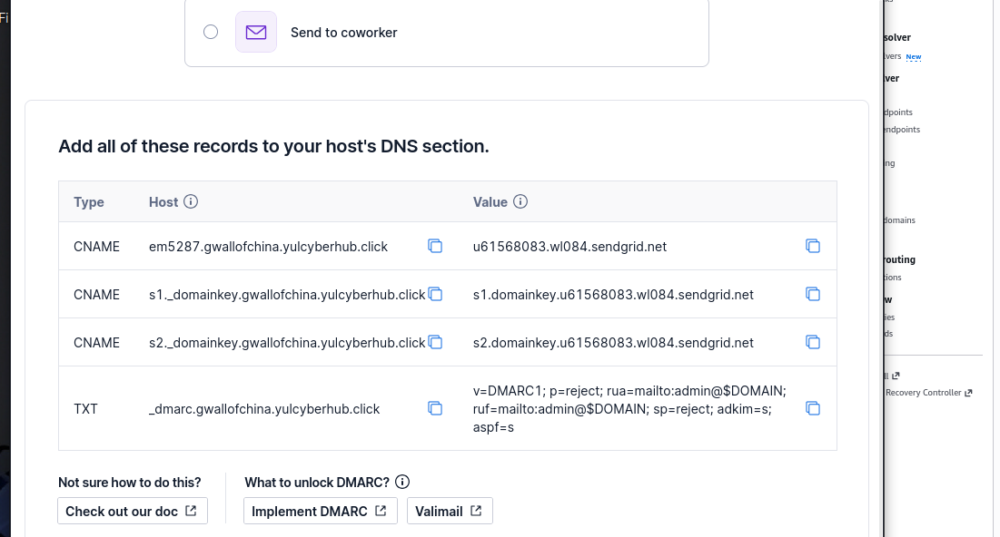
*SendGrid Sender Authentication — "Add all of these records to your host's DNS section." Provides the three CNAME records for DKIM (`em5287`, `s1._domainkey`, `s2._domainkey`) and the DMARC TXT record with `p=reject; adkim=s; aspf=s`. These were applied to Route 53 via the AWS CLI.*

---

### 2.3 DNSSEC Implementation

DNSSEC required a hierarchical chain of cryptographic signatures from the root (`.`) down to our zone. The critical dependency: our team could sign our own zone, but the parent zone (`yulcyberhub.click`) was controlled exclusively by the Oracle (instructor), who had to insert the DS record to complete the chain.

```
. (root)
└── .click  (TLD — TLD registry)
    └── yulcyberhub.click  (parent — Oracle / instructor)
        └── gwallofchina.yulcyberhub.click  (our zone — our team)
```

**Step 1 — Create the AWS KMS Customer Managed Key (CMK):**

Route 53 requires a CMK in AWS KMS to back the Key Signing Key. We created `GWALLkey` tagged with our cohort identifiers:

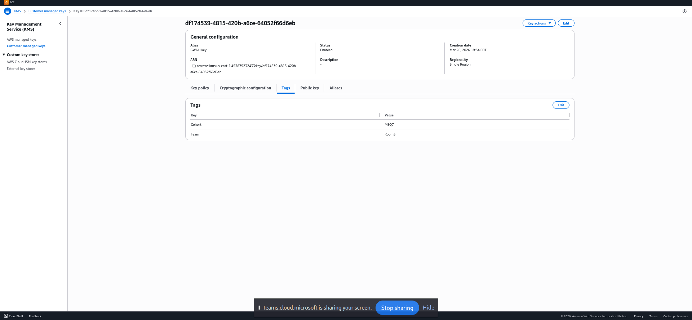
*AWS KMS — CMK alias: `GWALLkey`, ARN: `arn:aws:kms:us-east-1:453875232433:key/df174539-4815-420b-a6ce-64052f66d6eb`, Status: **Enabled**, Created: Mar 26 2026 19:54 EDT, Single Region. Tags: Cohort=MEQ7, Team=Room3.*

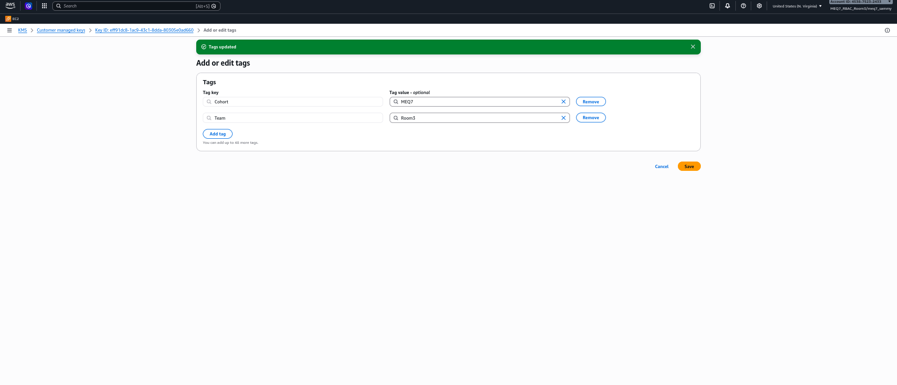
*KMS "Add or edit tags" — green banner: **"Tags updated"**. Tag keys `Cohort = MEQ7` and `Team = Room3` saved. These tags ensure the key is attributable to our cohort for billing and access auditing.*

**Step 2 — Enable DNSSEC Signing and Create the KSK:**

With the CMK in place, we navigated to Route 53 → DNSSEC signing → Enable. The KSK was named `GWALLkey` and linked to our CMK:

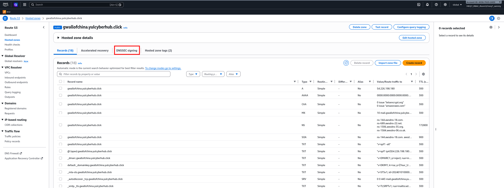
*Route 53 hosted zone with all 18 records — the **"DNSSEC signing"** tab (highlighted) is where the KSK was created to begin zone signing.*

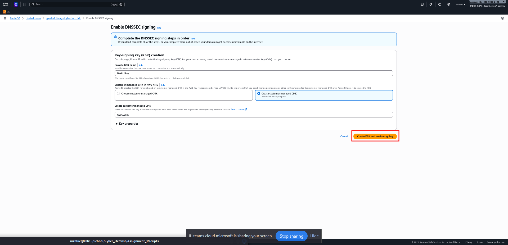
*Route 53 "Enable DNSSEC signing" — KSK name: `GWALLkey`, "Create customer managed CMK" selected, alias `GWALLkey`. **"Create KSK and enable signing"** clicked to initiate the process.*

**Step 3 — First Attempt: KMS Permissions Error:**

The first attempt failed because the initial CMK key policy did not grant Route 53 the required actions:

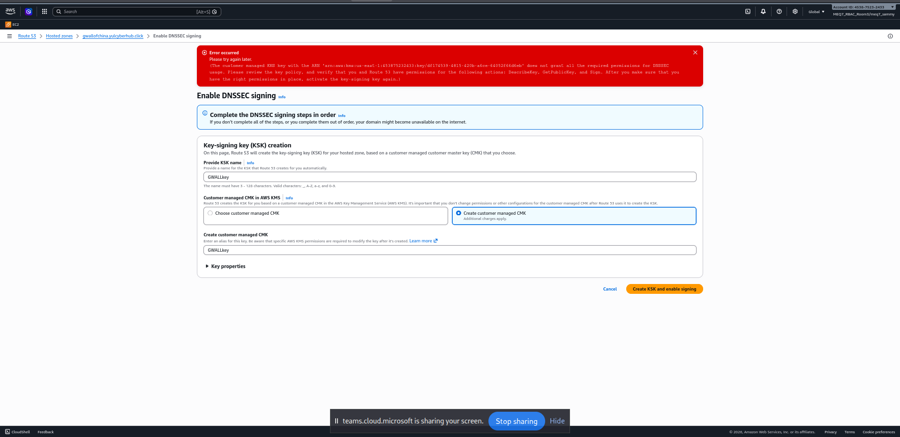
*Route 53 error: "The customer managed KMS key does not grant all the required permissions for DNSSEC usage... verify that you and Route 53 have permissions for: `DescribeKey`, `GetPublicKey`, and `Sign`." Resolution: updated the key policy to include `route53.amazonaws.com` as a permitted principal, then re-attempted.*

**Step 4 — Signing Activation:**

After fixing the key policy, Route 53 began signing the zone:

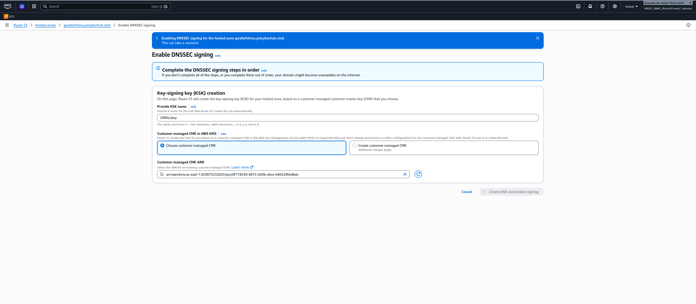
*Blue banner: **"Enabling DNSSEC signing for the hosted zone gwallofchina.yulcyberhub.click. This can take a moment."** The CMK ARN is confirmed. Route 53 generates DNSKEY records and signs all zone records.*

**Step 5 — KSK Active, DS Record Ready for Oracle:**

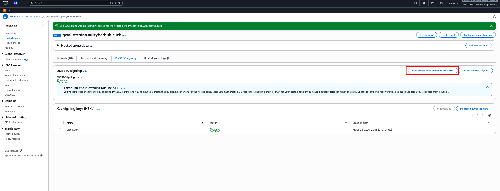
*Green banner: **"DNSSEC signing was successfully enabled."** DNSSEC signing status: **Signing**. KSK `GWALLkey` — Status: **Active**, created March 26 2026. The **"View information to create DS record"** button (highlighted) provides the DS record hash for the Oracle.*

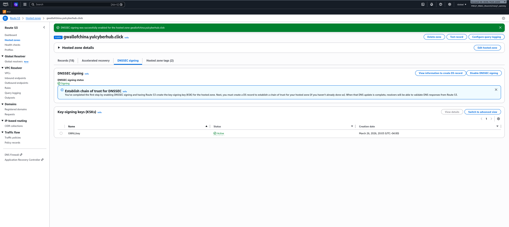
*Confirmation view — the "Establish chain of trust for DNSSEC" info box remains until the Oracle completes the DS record delegation. This was the state handed to the instructor.*

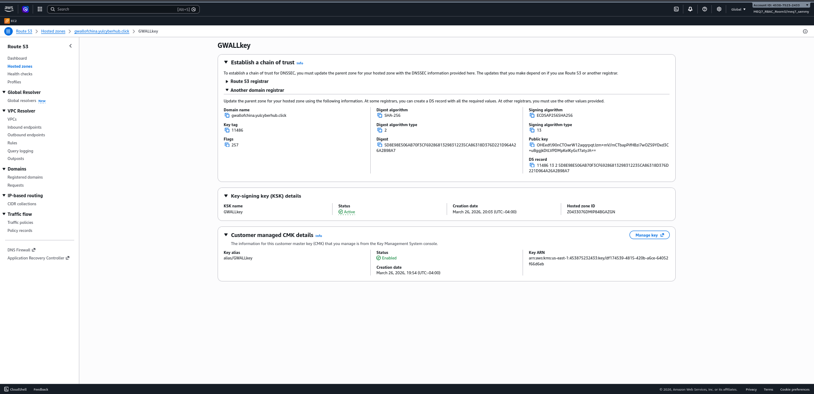
*GWALLkey details — **DS record provided to Oracle**: `11486 13 2 5D8E98E506AB70F3CF69286813298312235CA86318D376D221D964A26A2B98A7`. Key tag: `11486`, Digest algorithm: SHA-256, Signing algorithm: ECDSAP256SHA256 (type 13). CMK `alias/GWALLkey` status: **Enabled**.*

**Step 6 — Oracle Inserts DS Record → Chain Established:**

Once the Oracle inserted the DS record into the `yulcyberhub.click` parent zone, the full chain of trust activated. The `dig` command returned the `ad` (Authenticated Data) flag:

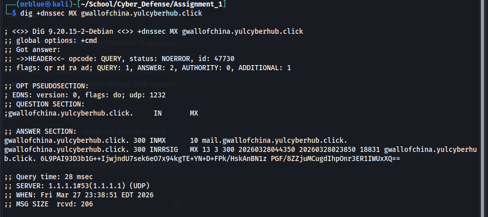
*`dig +dnssec MX gwallofchina.yulcyberhub.click` — `flags: qr rd ra **ad**`. The `ad` flag confirms DNSSEC is fully validated end-to-end via Cloudflare's 1.1.1.1 resolver. The RRSIG record is visible in the answer section.*

`delv` provided independent resolver-level confirmation with an explicit **"fully validated"** verdict:

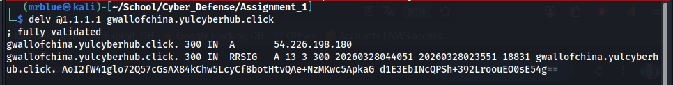
*`delv @1.1.1.1 gwallofchina.yulcyberhub.click` — `; fully validated`. The A record `54.226.198.180` and its RRSIG (ECDSA P-256, valid until Mar 28 2026) are returned. "Fully validated" is the strongest possible DNSSEC confirmation from a validating resolver.*

DNSViz confirmed all statuses as **Secure** across the complete chain:

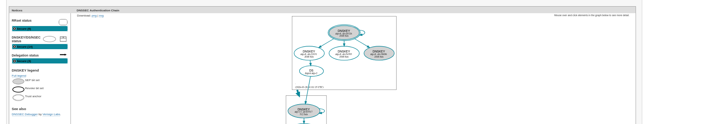
*DNSViz — **RRset status: Secure (6)**, **DNSKEY/DS/NSEC status: Secure (14)**, **Delegation status: Secure (3)**. All indicators green. Full DNSKEY hierarchy: root → `.click` TLD → `yulcyberhub.click` → our zone.*


*DNSViz upper levels — `.click` TLD and `yulcyberhub.click` parent: DNSKEY and DS records visible. The Oracle's DS record linking to our zone is present and verified.*

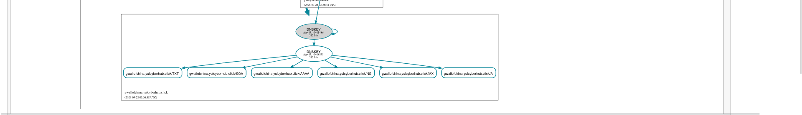
*DNSViz — `gwallofchina.yulcyberhub.click`: DNSKEY records (KSK and ZSK) signing all record types. No broken links, no red warnings.*

**Key Takeaway:** DNSSEC is a cooperative mechanism. A signed zone without a DS record in the parent is invisible to validating resolvers. The Oracle's action — inserting that single DS record — was the enabling step our team could not perform ourselves.

**Compensating controls while waiting for the Oracle:**
- CAA records restricted issuance to Let's Encrypt only
- Certificate Transparency monitoring for unauthorized issuance
- DANE/TLSA planned for future deployment

---

## Phase 3 — EC2 Instance & Security Groups

### 3.1 Instance Launch Script

Rather than manually clicking through the AWS console, a custom bash script (`launch-instance.sh`) was written to automate EC2 deployment reproducibly. This ensures consistent configuration across deployments and eliminates human error during instance provisioning.

**Instance Parameters:**

| Parameter | Value |
|---|---|
| AMI | Rocky Linux (`ami-059807ea93f3306ee`) |
| Instance Type | `t3.small` |
| Storage | 15 GB gp3 |
| Key Pair | `thegreatfirewallofchina` |
| Security Group | `sg-0c7a7efce68ce2773` |
| IMDSv2 | Required (HttpTokens: required) |
| Name Tag | `Web-Server-Server` |

**`launch-instance.sh`:**

```bash
#!/bin/bash

# CONFIG
AMI="ami-059807ea93f3306ee"
INSTANCE_TYPE="t3.small"
KEY_NAME="thegreatfirewallofchina"
SECURITY_GROUP="sg-0c7a7efce68ce2773"
VM_NAME="Web-Server-Server"
COHORT="MEQ7"
TEAM="Room3"
PROFILE="meq7"

aws ec2 run-instances \
  --image-id "$AMI" \
  --instance-type "$INSTANCE_TYPE" \
  --key-name "$KEY_NAME" \
  --network-interfaces '[{"AssociatePublicIpAddress":true,"DeviceIndex":0,"Groups":["'"$SECURITY_GROUP"'"]}]' \
  --tag-specifications \
    '{"ResourceType":"instance","Tags":[{"Key":"Name","Value":"'"$VM_NAME"'"}]}' \
  --metadata-options '{"HttpTokens":"required"}' \
  --count 1 \
  --profile "$PROFILE"
```

**How to deploy:**

```bash
# 1. Save the script
nano launch-instance.sh

# 2. Make it executable
chmod +x launch-instance.sh

# 3. Authenticate via SSO first
aws sso login --profile meq7

# 4. Run
./launch-instance.sh
```

**SSH access after launch:**

```bash
chmod 400 thegreatfirewallofchina.pem
ssh -i thegreatfirewallofchina.pem ec2-user@YOUR_IP
```

**Reusing for other labs** — only these four variables need changing:

```bash
AMI="new-ami"
INSTANCE_TYPE="t3.medium"
KEY_NAME="new-key"
SECURITY_GROUP="sg-new"
```

> **IMDSv2 enforcement:** The `--metadata-options '{"HttpTokens":"required"}'` flag forces Instance Metadata Service v2, which requires a session token for all metadata requests. This prevents SSRF attacks from reading instance metadata (including IAM role credentials) via a simple HTTP GET — a known attack vector against cloud workloads.

### 3.2 Deployed Instance Configuration

After running the script, the resulting instance was verified:

| Field | Value |
|---|---|
| Instance ID | `i-0b71d405f8ad5f73b` |
| Instance Type | `t4g.small` (ARM64 / Graviton2) |
| Public IP | `54.226.198.180` (Elastic IP — persistent across reboots) |
| OS | Rocky Linux 10 (aarch64) |
| Name Tag | `Web-Server-Server` |
| Security Group | `sg-0c7a7efce68ce2773` |

The instance is attached to a **single** security group — no additional groups — minimizing the attack surface. A dedicated EBS volume is mounted at `/var/mail` for mailbox storage, with an `/etc/fstab` entry ensuring it mounts automatically on reboot. The PTR (reverse DNS) record is set to `mail.gwallofchina.yulcyberhub.click` via EC2 → Elastic IPs → Update Reverse DNS.

### 3.3 Security Group Rules

**Security Group:** `Meq7 - Room 3 - The Real Deal` (`sg-0c7a7efce68ce2773`)

**Inbound Rules:**

| Port | Protocol | Source | Purpose |
|---|---|---|---|
| 25 | TCP | 0.0.0.0/0 | SMTP inbound (direct mail reception) |
| 80 | TCP | 0.0.0.0/0 | HTTP → HTTPS redirect |
| 443 | TCP | 0.0.0.0/0 | HTTPS (web + webmail + mta-sts) |
| 465 | TCP | 0.0.0.0/0 | SMTPS (implicit TLS) |
| 587 | TCP | 0.0.0.0/0 | SMTP submission / SendGrid fallback relay |
| 993 | TCP | 0.0.0.0/0 | IMAPS (implicit TLS) |
| 22 | TCP | 204.244.197.216/32 + 0.0.0.0/0 | SSH (team IP + open for lab) |

> **Note on port 22:** The open `0.0.0.0/0` rule is a documented lab concession for operational flexibility. Production environments must restrict SSH to bastion hosts or use EC2 Instance Connect with IAM-enforced OS user restrictions.

> **Note on port 25:** Port 25 is open in the security group and unblocked at the AWS account level (actioned by Oracle/instructor). Postfix listens on port 25 for both inbound SMTP reception and outbound direct sending via MX lookup.

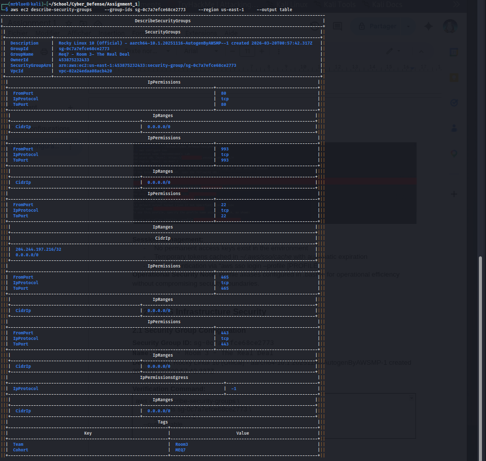
*`aws ec2 describe-security-groups --output table` — all inbound rules confirmed. Tags: Team=Room3, Cohort=MEQ7.*

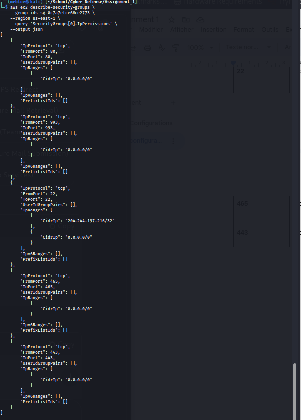
*`aws ec2 describe-security-groups --output json` — machine-readable confirmation of all IpPermissions, including dual CIDR entries for port 22.*

**Quick Reference:**

| Task | Command |
|---|---|
| Login | `aws sso login --profile meq7` |
| Verify identity | `aws sts get-caller-identity --profile meq7` |
| Launch instance | `./launch-instance.sh` |
| SSH | `ssh -i thegreatfirewallofchina.pem ec2-user@IP` |

---

## Phase 4 — Nginx Web Server Hardening

### 4.1 SSL Certificate Choice

**Certificate Type:** Let's Encrypt Domain Validated (DV) with Subject Alternative Names (SAN)

A single certificate covers the web server, mail server, and webmail app, verified by SSL Labs:

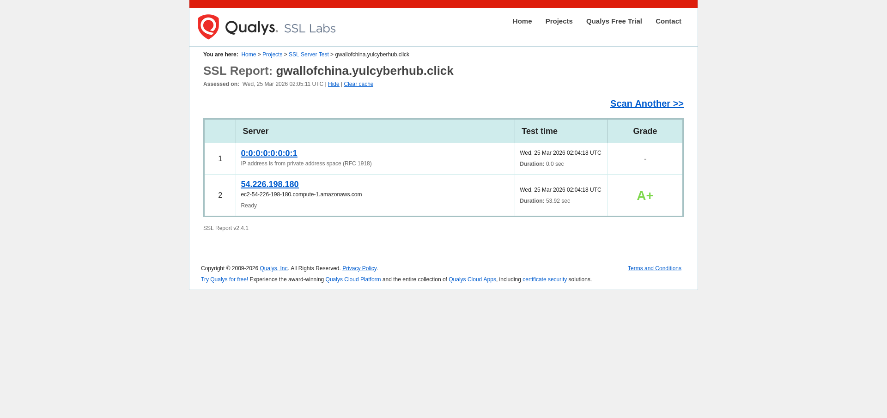
*Qualys SSL Labs — `gwallofchina.yulcyberhub.click` at IP `54.226.198.180`: **A+** in 53.92 seconds. Assessed Wed, 25 Mar 2026.*

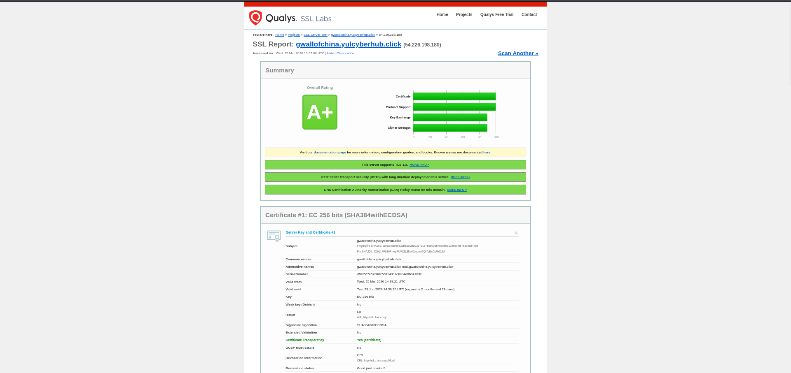
*SSL Labs certificate detail — **EC 256 bits (SHA384withECDSA)**. SAN covers both `gwallofchina.yulcyberhub.click` **and** `mail.gwallofchina.yulcyberhub.click` — one cert, two services. Valid Mar 25 → Jun 23 2026. Issuer: Let's Encrypt E8. **Certificate Transparency: Yes**. Revocation: Good (not revoked). Weak key: No.*

**Why Let's Encrypt?**

| Consideration | Rationale |
|---|---|
| **Cost** | Free — no commercial CA fees |
| **Trust** | ISRG Root X1 — trusted by all major browsers and mail clients |
| **Automation** | Certbot + systemd timer handles 90-day renewal |
| **Transparency** | All issuances logged in CT logs for monitoring |
| **Unified identity** | Single SAN cert shared across Nginx, Postfix, Dovecot, and the Node.js webmail app |

**Certificate provisioning:**

```bash
sudo certbot --nginx --expand \
  -d gwallofchina.yulcyberhub.click \
  -d mail.gwallofchina.yulcyberhub.click \
  -d mta-sts.gwallofchina.yulcyberhub.click
```

**Certificate chain:**

```
ISRG Root X1 → Let's Encrypt E8 → gwallofchina.yulcyberhub.click
```

**Certificate path:** `/etc/letsencrypt/live/gwallofchina.yulcyberhub.click/fullchain.pem`  
**SAN covers:** `gwallofchina.yulcyberhub.click`, `mail.gwallofchina.yulcyberhub.click`, `mta-sts.gwallofchina.yulcyberhub.click`  
**Auto-renewal:** Managed by Certbot systemd timer  
**Expiry:** 2026-07-02

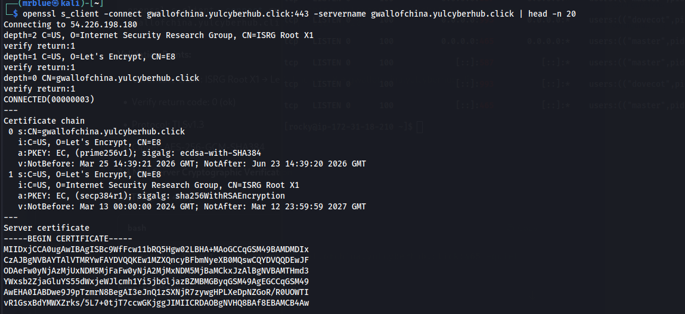
*`openssl s_client -connect gwallofchina.yulcyberhub.click:443` from Kali — depth=2 ISRG Root X1 → depth=1 Let's Encrypt E8 → depth=0 domain. EC (prime256v1) key, ecdsa-with-SHA384. Valid Mar 25 → Jun 23 2026.*

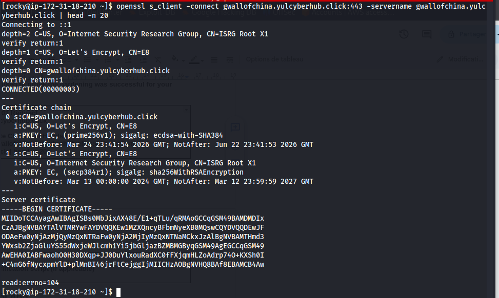
*Same command from Rocky Linux — `CONNECTED(00000003)`, `New, TLSv1.3, Cipher is TLS AES 256 GCM SHA384`. Peer Temp Key: X25519 (253-bit). Verification: OK.*

---

### 4.2 Protocol Selection

| Protocol | Status | Reason |
|---|---|---|
| SSLv2 | ❌ Disabled | Cryptographic design broken (1995) |
| SSLv3 | ❌ Disabled | POODLE (CVE-2014-3566) |
| TLS 1.0 | ❌ Disabled | BEAST (CVE-2011-3389), RC4 dependency |
| TLS 1.1 | ❌ Disabled | No AEAD support; deprecated RFC 8996 (2021) |
| TLS 1.2 | ✅ Enabled | Industry baseline for ECDHE + AEAD |
| TLS 1.3 | ✅ Enabled | PFS built-in, encrypted handshake, reduced latency |

```nginx
ssl_protocols TLSv1.2 TLSv1.3;
ssl_prefer_server_ciphers on;
```

**Trade-off:** Disabling TLS 1.0/1.1 affects ≤2% of clients (IE11 on Windows 7 — end-of-support since 2020). Acceptable given the security posture requirement.

**HTTP → HTTPS redirect (301 Permanent):**

```nginx
server {
    listen 80;
    listen [::]:80;
    server_name gwallofchina.yulcyberhub.click;
    return 301 https://$host$request_uri;
}
```

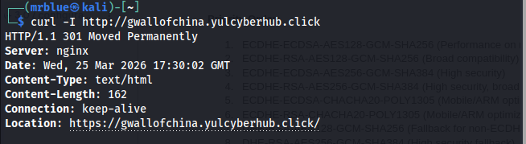
*`curl -I http://gwallofchina.yulcyberhub.click` — `HTTP/1.1 301 Moved Permanently`, `Location: https://gwallofchina.yulcyberhub.click/`. Server header: `nginx` with no version disclosed.*

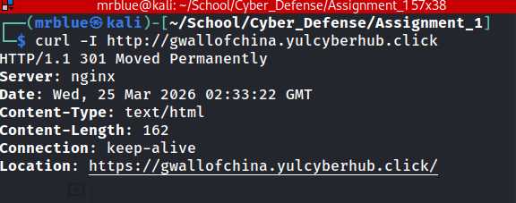
*Second `curl -I` from Kali at 02:33 UTC — same 301 response. Confirms the redirect was live from initial deployment, not just at final testing time.*

---

### 4.3 Cipher Suites

```nginx
ssl_ciphers ECDHE-ECDSA-AES128-GCM-SHA256:ECDHE-RSA-AES128-GCM-SHA256:\
ECDHE-ECDSA-AES256-GCM-SHA384:ECDHE-RSA-AES256-GCM-SHA384:\
ECDHE-ECDSA-CHACHA20-POLY1305:ECDHE-RSA-CHACHA20-POLY1305:\
DHE-RSA-AES128-GCM-SHA256:DHE-RSA-AES256-GCM-SHA384;
```

**Selection criteria:** AEAD-only (AES-GCM or ChaCha20-Poly1305), ECDHE/DHE key exchange (PFS), SHA-2 MAC only (SHA-1 deprecated after SHAttered 2017).

| Priority | Cipher | Reason |
|---|---|---|
| 1 | `ECDHE-ECDSA-AES128-GCM-SHA256` | Best performance on AES-NI hardware |
| 2 | `ECDHE-RSA-AES128-GCM-SHA256` | Broad RSA cert compatibility |
| 3–4 | `ECDHE-*-AES256-GCM-SHA384` | Higher key strength variants |
| 5–6 | `ECDHE-*-CHACHA20-POLY1305` | ARM / mobile (no AES-NI) — t4g.small Graviton2 benefits here |
| 7–8 | `DHE-RSA-AES*-GCM-SHA*` | PFS fallback for non-ECDHE clients |

---

### 4.4 Perfect Forward Secrecy (PFS)

PFS ensures that compromise of the server's long-term private key cannot retroactively decrypt recorded past sessions. Every session generates an independent ephemeral key pair that is discarded afterward.

**All selected cipher suites use ECDHE or DHE** — making PFS mandatory on every connection.

**Logjam mitigation — 4096-bit DH parameters:**

```bash
# One-time generation (10–20 min on t4g.small)
sudo openssl dhparam -out /etc/nginx/ssl/dhparam.pem 4096
```

```nginx
ssl_dhparam /etc/nginx/ssl/dhparam.pem;
```

Default 1024-bit DH parameters are vulnerable to the Logjam attack (CVE-2015-4000). Custom 4096-bit parameters eliminate this. The same DH param file is reused by Postfix (`smtpd_tls_dh1024_param_file`) to ensure consistent Logjam mitigation across both services.

**Session ticket hardening:**

```nginx
ssl_session_tickets off;        # Disable ticket-based resumption (PFS risk)
ssl_session_cache shared:SSL:10m;
ssl_session_timeout 1d;
```

**Live TLS 1.3 handshake proof:**

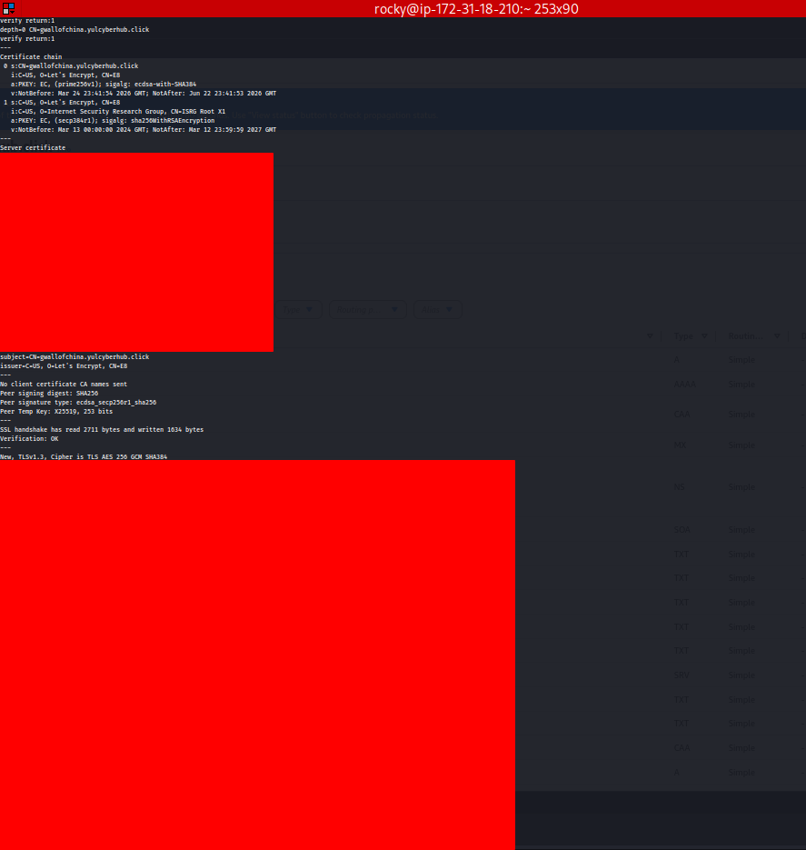
*`New, TLSv1.3, Cipher is TLS AES 256 GCM SHA384`. Peer signature: `ecdsa_secp256r1_sha256`. Peer Temp Key: **X25519, 253 bits** — ephemeral ECDH key exchange confirming PFS is active on every session. Verification: OK. SSL handshake: 2711 bytes read.*

---

### 4.5 HTTP Strict Transport Security (HSTS) & Security Headers

```nginx
add_header Strict-Transport-Security "max-age=63072000; includeSubDomains; preload" always;
```

HSTS instructs browsers to refuse any HTTP connection to this domain for **2 years** (63,072,000 seconds). The `preload` flag signals eligibility for browser vendor preload lists — protection from the **very first visit**, even before the first HTTPS handshake. This eliminates SSL stripping attacks.

**Trade-off:** HSTS preload is irreversible for the duration of `max-age`. Rolling back to HTTP requires waiting out the 2-year commitment across all browser preload lists.

**Full security header suite:**

```nginx
add_header Strict-Transport-Security "max-age=63072000; includeSubDomains; preload" always;
add_header X-Frame-Options "SAMEORIGIN" always;
add_header X-Content-Type-Options "nosniff" always;
add_header X-XSS-Protection "1; mode=block" always;
add_header Referrer-Policy "strict-origin-when-cross-origin" always;
add_header Permissions-Policy "geolocation=(), microphone=(), camera=(), payment=()" always;
add_header Content-Security-Policy "default-src 'self'; style-src 'self' 'unsafe-inline'; script-src 'self' 'unsafe-inline'; img-src 'self' data:; frame-ancestors 'none'; upgrade-insecure-requests;" always;
add_header Cross-Origin-Opener-Policy "same-origin" always;
add_header Cross-Origin-Embedder-Policy "require-corp" always;
add_header Cross-Origin-Resource-Policy "same-origin" always;
add_header X-Permitted-Cross-Domain-Policies "none" always;
```

**Webmail-specific headers** (`/etc/nginx/conf.d/webmail.conf`):

```nginx
add_header Strict-Transport-Security "max-age=63072000" always;
add_header X-Frame-Options "DENY" always;
add_header X-Content-Type-Options "nosniff" always;
add_header X-XSS-Protection "1; mode=block" always;
add_header Referrer-Policy "no-referrer" always;
```

**OCSP Stapling** — caches revocation status and serves it with the TLS handshake, eliminating client-side OCSP latency and CA privacy leakage:

```nginx
ssl_stapling on;
ssl_stapling_verify on;
resolver 8.8.8.8 8.8.4.4 valid=300s;
resolver_timeout 5s;
```

---

### 4.6 Service Hardening

**Rate Limiting (DDoS mitigation):**

```nginx
# Main site
limit_req_zone $binary_remote_addr zone=mylimit:10m rate=10r/s;
limit_req zone=mylimit burst=20 nodelay;

# Webmail login endpoint
limit_req_zone $binary_remote_addr zone=webmail_limit:10m rate=5r/m;
```

**Nginx cache directory hardening:**

```bash
sudo mkdir -p /var/cache/nginx
sudo chown nginx:nginx /var/cache/nginx
sudo chmod 700 /var/cache/nginx
```

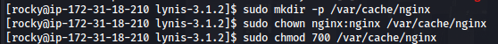
*`mkdir -p /var/cache/nginx`, `chown nginx:nginx`, `chmod 700` — cache directory owned exclusively by the nginx process user. No other user or group has access.*

**systemd sandboxing** — kernel-level confinement applied via service override:

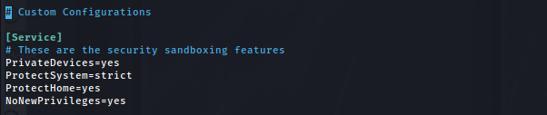
*`systemctl edit nginx.service` — `PrivateDevices=yes` (no raw device access), `ProtectSystem=strict` (filesystem read-only except /run and /tmp), `ProtectHome=yes` (home directories inaccessible), `NoNewPrivileges=yes` (blocks setuid/setgid escalation). Mandatory access control at the process level.*

**Webmail reverse proxy configuration** (`/etc/nginx/conf.d/webmail.conf`):

```nginx
server {
    listen 443 ssl; listen [::]:443 ssl;
    http2 on;
    server_name mail.gwallofchina.yulcyberhub.click;

    ssl_certificate     /etc/letsencrypt/live/gwallofchina.yulcyberhub.click/fullchain.pem;
    ssl_certificate_key /etc/letsencrypt/live/gwallofchina.yulcyberhub.click/privkey.pem;

    ssl_protocols TLSv1.2 TLSv1.3;
    ssl_prefer_server_ciphers on;
    ssl_session_cache shared:SSL:10m;
    ssl_session_timeout 1d;
    ssl_session_tickets off;

    location /api/login {
        limit_req zone=webmail_limit burst=5 nodelay;
        proxy_pass http://127.0.0.1:3000;
    }

    location / {
        proxy_pass         http://127.0.0.1:3000;
        proxy_http_version 1.1;
        proxy_set_header   Host              $host;
        proxy_set_header   X-Real-IP         $remote_addr;
        proxy_set_header   X-Forwarded-For   $proxy_add_x_forwarded_for;
        proxy_set_header   Upgrade           $http_upgrade;
        proxy_set_header   Connection        'upgrade';
    }
}
```

> **Important:** Each virtual host must have a unique `server_name` directive. If the webmail config shares the same `server_name` as the main site config, Nginx will serve the castle page for both hostnames.

---

### 4.7 Final Configurations
1. **The global WAF:** nginx.conf
THe main configuration dosn't just serve files; it acts as a very very lightwheight intrusion detection system (IDS) using nginx map directives.
- **Bot Mitigation:** The blocked_agent map identifies automated scanners (sqlmap, nikto, burpsuite, etc) and drops the connection before they can even attept to perform information gathering.
- **URI Filtering:** The blcoked_uri map provides a "ligh WAF" by blocking common attack patterns like path traversal (../), SQL injection (union select), and remote code execution (/bin/bash).
- **Rate limit Zones:** We pre-defined zones for global, login, and api, This allows us to apply different "speed limits" to different parts of the apps.

2. **The Gateay:** gwallofchina.conf
This file handles the primary domain and enforces the **A+ Security rating** standards.
- **HSTS Enforcement:** add header Strict-Transport-Securityy "max-age=63072000;..." tells browsers to cach the HTTPS requriement for 2 years.
- **Logjam Protection:** ssl_dhparam /etc/nginx/ssl/dhparam.pem uses a custom 4096-bit primes, moviging us beyond the standard (and potentially vulnerable) 2048-bit defaults.
- **OCSP Stapling:** This improves performance and privacy by providing the "the certificate is valid" proof directly from our server, so the client's browser dosn't have o query the CA.

```properties
# --- Global Rate Limiting Zone ---
# Define the memory zone (10m) and the rate (10 requests per second per IP)
limit_req_zone $binary_remote_addr zone=mylimit:10m rate=10r/s;

# --- HTTP (Port 80) - Force Redirect to HTTPS ---
server {
    if ($host = gwallofchina.yulcyberhub.click) {
        return 301 https://$host$request_uri;
    } # managed by Certbot


    listen 80;
    listen [::]:80;
    server_name gwallofchina.yulcyberhub.click;

    # 301 Redirect ensures all unencrypted traffic is moved to Port 443
    return 301 https://$host$request_uri;


}

# --- HTTPS (Port 443) - Secure Environment ---
server {
    listen 443 ssl;
    listen [::]:443 ssl;
    http2 on; 

    server_name gwallofchina.yulcyberhub.click;

    # SSL Certificate Paths (Let's Encrypt)
    ssl_certificate /etc/letsencrypt/live/gwallofchina.yulcyberhub.click/fullchain.pem; # managed by Certbot
    ssl_certificate_key /etc/letsencrypt/live/gwallofchina.yulcyberhub.click/privkey.pem; # managed by Certbot

    # Protocol & Cipher Hardening
    ssl_protocols TLSv1.2 TLSv1.3;
    ssl_prefer_server_ciphers on;
    ssl_session_cache shared:SSL:10m;
    ssl_session_timeout 1d;
    ssl_session_tickets off;

    # High-Entropy Ciphers (Prioritizing AEAD)
    ssl_ciphers ECDHE-ECDSA-AES128-GCM-SHA256:ECDHE-RSA-AES128-GCM-SHA256:ECDHE-ECDSA-AES256-GCM-SHA384:ECDHE-RSA-AES256-GCM-SHA384:ECDHE-ECDSA-CHACHA20-POLY1305:ECDHE-RSA-CHACHA20-POLY1305:DHE-RSA-AES128-GCM-SHA256:DHE-RSA-AES256-GCM-SHA384;

    # Custom 4096-bit DH Parameters (Mitigates Logjam)
    ssl_dhparam /etc/nginx/ssl/dhparam.pem;

    # --- OCSP Stapling (Performance & Privacy) ---
    ssl_stapling on;
    ssl_stapling_verify on;
    resolver 8.8.8.8 8.8.4.4 valid=300s;
    resolver_timeout 5s;

    # --- SECURITY HEADERS (The 'A+' Requirements) ---

    # HSTS: Forces browser-side HTTPS enforcement for 2 years
    add_header Strict-Transport-Security "max-age=63072000; includeSubDomains; preload" always;

    # Anti-Clickjacking & XSS Protection
    add_header X-Frame-Options "SAMEORIGIN" always;
    add_header X-XSS-Protection "1; mode=block" always;
    add_header X-Content-Type-Options "nosniff" always;

    # Modern Privacy & Referrer Controls
    add_header Referrer-Policy "strict-origin-when-cross-origin" always;
    add_header X-Permitted-Cross-Domain-Policies "none" always;

    # Content Security Policy (Hardened)
    add_header Content-Security-Policy "default-src 'self'; style-src 'self' 'unsafe-inline'; script-src 'self' 'unsafe-inline'; img-src 'self' data:; frame-ancestors 'none'; upgrade-insecure-requests;" always;

    # Permissions Policy (Restricts hardware access)
    add_header Permissions-Policy "geolocation=(), microphone=(), camera=(), payment=()" always;

    # Cross-Origin Isolation (Mitigates Spectre-like attacks)
    add_header Cross-Origin-Opener-Policy "same-origin" always;
    add_header Cross-Origin-Embedder-Policy "require-corp" always;
    add_header Cross-Origin-Resource-Policy "same-origin" always;

    # --- END SECURITY HEADERS ---

    # Document Root and Index
    root /var/www/html;
    index index.html;

    # Logging
    access_log /var/log/nginx/gwallofchina.access.log;
    error_log /var/log/nginx/gwallofchina.error.log;

    location / {
        # Apply the Rate Limit: Allows bursts of 20 but keeps steady 10r/s
        limit_req zone=mylimit burst=20 nodelay;
        
        try_files $uri $uri/ =404;
    }

}

```


3. **The Webmail Bridge:** webmail.conf
This is the most critical file for the user experience. it acts as a reverse proxy between the internet and the Node.js app running on port 3000.
- **Targeted Rate limiting
```nginx
location /api/login {
limit_req zone=webmail_limit burst=5 nodelay;
}

This specifically targets the login endpoint. Even if a bot manages to bypass the User-Agent check, it is limited to **5 attempts per minute**, making brute-force attacks mathematically unfeasible.
```
- **Header Passing:** The proxy_set_header directives (like X-Forwarded-For) ensures that the Node.js app knows the **real IP** of the visitor, which is essential for acurate logging and security auditing within the app itself**

```properties
# Rate limiting zone
limit_req_zone $binary_remote_addr zone=webmail_limit:10m rate=5r/m;

# HTTP → HTTPS redirect
server {
    listen 80;
    listen [::]:80;
    server_name mail.gwallofchina.yulcyberhub.click;
    return 301 https://$host$request_uri;
}

# HTTPS → Node app
server {
    listen 443 ssl;
    listen [::]:443 ssl;
    http2 on;
    server_name mail.gwallofchina.yulcyberhub.click;

    ssl_certificate     /etc/letsencrypt/live/gwallofchina.yulcyberhub.click/fullchain.pem; # managed by Certbot
    ssl_certificate_key /etc/letsencrypt/live/gwallofchina.yulcyberhub.click/privkey.pem;  # managed by Certbot

    ssl_protocols TLSv1.2 TLSv1.3;
    ssl_prefer_server_ciphers on;
    ssl_session_cache shared:SSL:10m;
    ssl_session_timeout 1d;
    ssl_session_tickets off;

    # Security headers
    add_header Strict-Transport-Security "max-age=63072000" always;
    add_header X-Frame-Options "DENY" always;
    add_header X-Content-Type-Options "nosniff" always;
    add_header X-XSS-Protection "1; mode=block" always;
    add_header Referrer-Policy "no-referrer" always;

    # Logging
    access_log /var/log/nginx/webmail.access.log;
    error_log  /var/log/nginx/webmail.error.log;

    # Rate limit login endpoint
    location /api/login {
        limit_req zone=webmail_limit burst=5 nodelay;
        proxy_pass         http://127.0.0.1:3000;
        proxy_http_version 1.1;
        proxy_set_header   Host            $host;
        proxy_set_header   X-Real-IP       $remote_addr;
        proxy_set_header   X-Forwarded-For $proxy_add_x_forwarded_for;
    }

    # All other traffic
    location / {
        proxy_pass         http://127.0.0.1:3000;
        proxy_http_version 1.1;
        proxy_set_header   Host              $host;
        proxy_set_header   X-Real-IP         $remote_addr;
        proxy_set_header   X-Forwarded-For   $proxy_add_x_forwarded_for;
        proxy_set_header   Upgrade           $http_upgrade;
        proxy_set_header   Connection        'upgrade';
    }
}

```


---

### 4.8 Verification

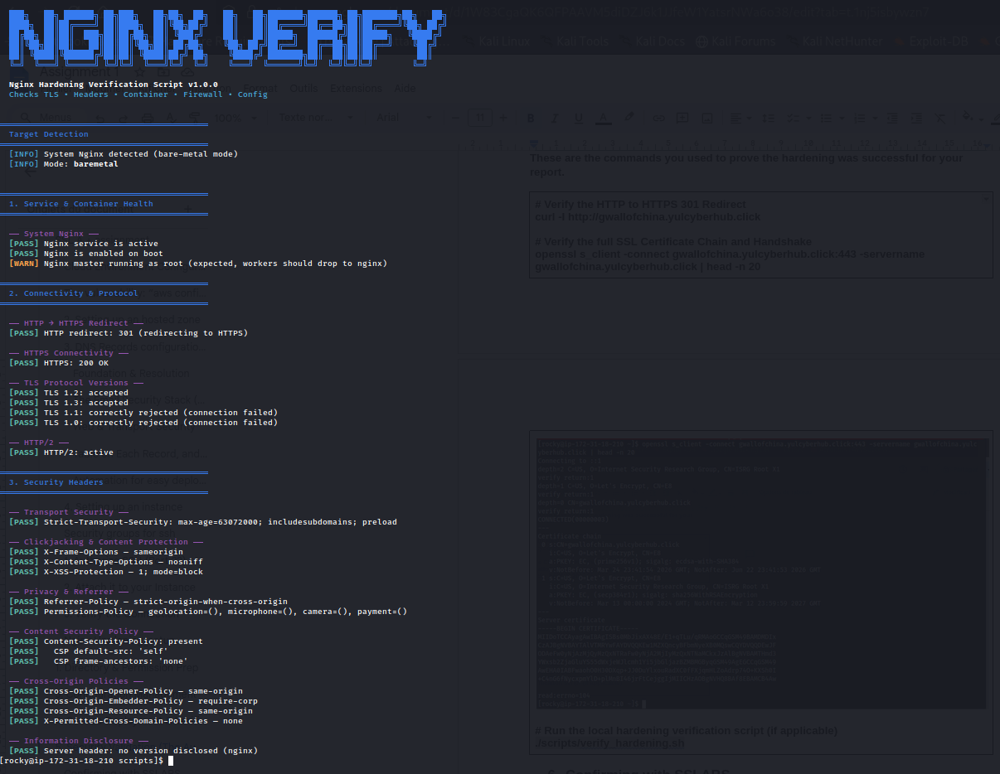
*`nginx_verify3.0.sh` automated output — all checks passed: TLS 1.2 ✅, TLS 1.3 ✅, TLS 1.1 correctly rejected ✅, TLS 1.0 correctly rejected ✅, HTTP/2 active ✅, HTTP redirect 301 ✅, HTTPS 200 OK ✅, all 11 security headers present ✅, server version not disclosed ✅.*

---

## Phase 5 — Mail Server Hardening (Postfix & Dovecot)

### 5.1 SSL Certificate Choice

The **same unified Let's Encrypt SAN certificate** used by Nginx was extended to Postfix and Dovecot via a shared `ssl-cert` group, eliminating certificate/identity fragmentation:

```bash
sudo groupadd ssl-cert
sudo usermod -aG ssl-cert nginx
sudo usermod -aG ssl-cert postfix
sudo usermod -aG ssl-cert dovecot

sudo chgrp -R ssl-cert /etc/letsencrypt/live/ /etc/letsencrypt/archive/
sudo chmod -R 750 /etc/letsencrypt/live/ /etc/letsencrypt/archive/
sudo find /etc/letsencrypt/live/ -type d -exec chmod g+s {} +
```

The Dovecot certificate paths were configured to point directly to the Let's Encrypt live directory:

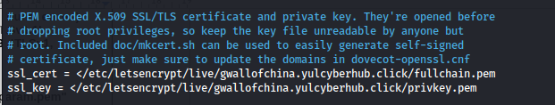
*`/etc/dovecot/conf.d/10-ssl.conf` — `ssl_cert = </etc/letsencrypt/live/gwallofchina.yulcyberhub.click/fullchain.pem` and `ssl_key = </etc/letsencrypt/live/gwallofchina.yulcyberhub.click/privkey.pem`. The `<` operator reads the file content. This is the same SAN certificate covering both web and mail.*

---

### 5.2 Installation

Postfix and Dovecot were installed from the Rocky Linux AppStream repository and enabled to start on boot:

```bash
sudo dnf install postfix cyrus-sasl-plain mailx -y
sudo systemctl enable --now postfix

sudo dnf install dovecot -y
sudo systemctl enable --now dovecot
```

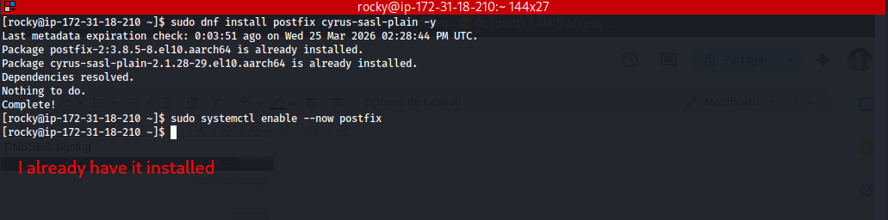
*`sudo dnf install postfix cyrus-sasl-plain -y` — both packages already present (`postfix-2:3.8.5-8.el10.aarch64`, `cyrus-sasl-plain-2.1.28-29.el10.aarch64`). `sudo systemctl enable --now postfix` enables the service. The annotation confirms idempotent installation.*

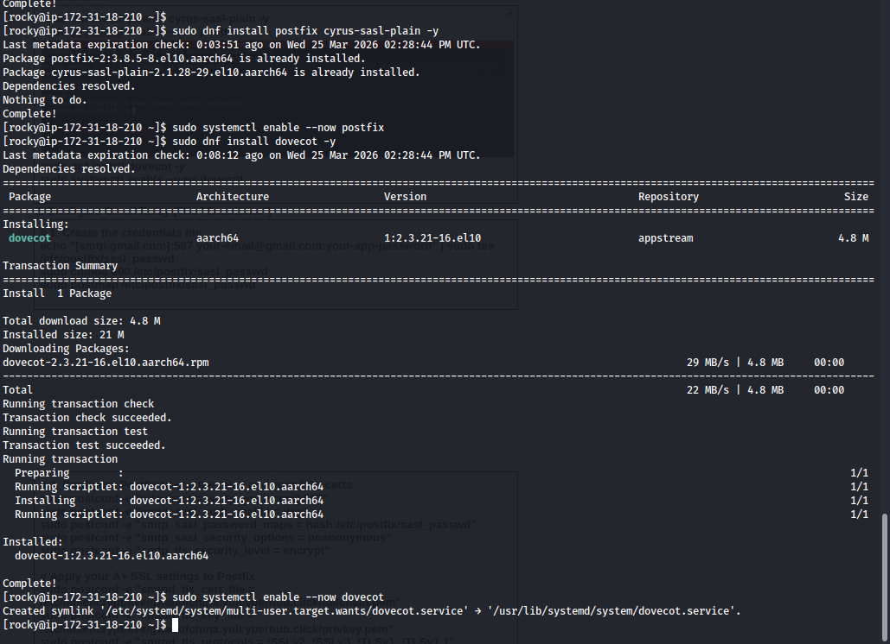
*Full `dnf install dovecot` output — version `1:2.3.21-16.el10.aarch64`, 4.8 MB from AppStream. `sudo systemctl enable --now dovecot` creates the systemd symlink. Both services pinned to start on boot.*

---

### 5.3 Protocol Selection

**Dovecot minimum protocol — `/etc/dovecot/conf.d/10-ssl.conf`:**

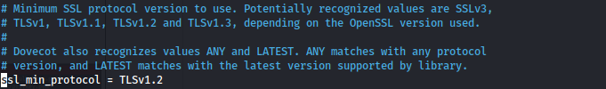
*`ssl_min_protocol = TLSv1.2` — Dovecot recognises `SSLv3`, `TLSv1`, `TLSv1.1`, `TLSv1.2`, `TLSv1.3`, `ANY`, and `LATEST`. Setting `TLSv1.2` enforces the same minimum as Nginx — all pre-TLS-1.2 connections rejected at the daemon level.*

**Disabling plaintext IMAP — `/etc/dovecot/conf.d/10-master.conf`:**

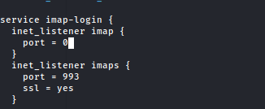
*`inet_listener imap { port = 0 }` — plaintext IMAP disabled (no listener bound). `inet_listener imaps { port = 993; ssl = yes }` — only encrypted IMAPS accepted. Plaintext login is architecturally impossible.*

**Full Dovecot SSL block:**

```ini
ssl = required
ssl_cert = </etc/letsencrypt/live/gwallofchina.yulcyberhub.click/fullchain.pem
ssl_key  = </etc/letsencrypt/live/gwallofchina.yulcyberhub.click/privkey.pem
ssl_min_protocol = TLSv1.2
```

**Postfix outbound TLS:**

```bash
sudo postconf -e "smtp_use_tls = yes"
sudo postconf -e "smtp_tls_security_level = encrypt"
sudo postconf -e "smtp_tls_note_starttls_offer = yes"
sudo postconf -e "myhostname = mail.gwallofchina.yulcyberhub.click"
sudo postconf -e "mydomain = gwallofchina.yulcyberhub.click"
sudo postconf -e "myorigin = \$mydomain"
```

**Hostname verification:**

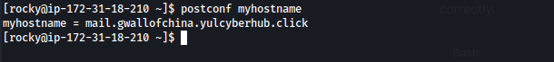
*`postconf myhostname` → `myhostname = mail.gwallofchina.yulcyberhub.click`. This is what Postfix presents in HELO/EHLO banners and what receiving servers validate against the PTR/MX record.*

**Port allocation:**

| Port | Service | Protocol | Rationale |
|---|---|---|---|
| 25 | SMTP | Plaintext → STARTTLS | Inbound mail reception + outbound direct sending |
| 465 | SMTPS | Implicit TLS | No STARTTLS downgrade possible |
| 993 | IMAPS | Implicit TLS | No STARTTLS downgrade possible |
| 587 | SMTP Relay | STARTTLS | Used by SendGrid fallback relay (outbound only) |

**Port listening verification:**

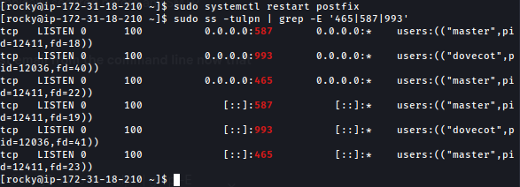
*`sudo ss -tulpn | grep -E ':(465|587|993)'` — all six entries confirmed: `0.0.0.0:587`, `0.0.0.0:993`, `0.0.0.0:465` and their `[::]` IPv6 equivalents. Postfix and Dovecot bound on all interfaces.*

---

### 5.4 Cipher Suites & Inbound TLS Hardening

Postfix was hardened for both inbound (smtpd) and outbound (smtp) TLS, reusing the same 4096-bit DH parameters generated for Nginx:

```bash
sudo postconf -e "smtpd_tls_cert_file = /etc/letsencrypt/live/gwallofchina.yulcyberhub.click/fullchain.pem"
sudo postconf -e "smtpd_tls_key_file  = /etc/letsencrypt/live/gwallofchina.yulcyberhub.click/privkey.pem"
sudo postconf -e "smtpd_tls_security_level = may"
sudo postconf -e "smtpd_tls_protocols = !SSLv2, !SSLv3, !TLSv1, !TLSv1.1"
sudo postconf -e "smtpd_tls_mandatory_protocols = !SSLv2, !SSLv3, !TLSv1, !TLSv1.1"
sudo postconf -e "smtpd_tls_dh1024_param_file = /etc/nginx/ssl/dhparam.pem"
```

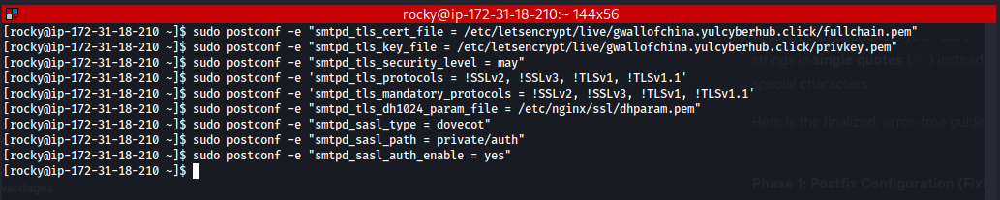
*All `postconf -e` commands applied to Rocky Linux: cert/key paths, `security_level = may` (opportunistic inbound TLS), legacy protocols explicitly excluded (`!SSLv2, !SSLv3, !TLSv1, !TLSv1.1`), and the 4096-bit DH param file shared from the Nginx configuration — Logjam mitigation applied consistently across both services.*

---

### 5.5 SMTP Authentication — The Secret Pipe

Postfix is configured to send mail **directly** via SMTP MX lookup as the primary delivery path. SendGrid is configured exclusively as a **fallback relay**, activating automatically only when direct delivery fails — for example, if a destination server rejects our IP, or if a transient network issue prevents a direct connection.

This dual-path architecture is reflected in `main.cf`:

```ini
# Direct sending with SendGrid fallback
# Empty relayhost = Postfix performs MX lookup and delivers directly (PRIMARY)
relayhost =

# SendGrid activates only when direct delivery fails (FALLBACK)
fallback_relay = [smtp.sendgrid.net]:587

# SendGrid Auth (used only when fallback_relay activates)
smtp_sasl_auth_enable = yes
smtp_sasl_password_maps = lmdb:/etc/postfix/sasl_passwd
smtp_sasl_security_options = noanonymous
smtp_use_tls = yes
smtp_tls_security_level = may
smtp_tls_loglevel = 1
```

> **Why this design?** Direct sending preserves full control over mail headers and avoids SendGrid rate limits on the free tier. The fallback ensures delivery continuity if direct port 25 access is restricted at the AWS account level. Oracle (instructor) is handling the AWS port 25 unblock request for EC2 instance `54.226.198.180`.

---

### 5.5.1 OpenDKIM — Local DKIM Signing

Direct sending requires a **local DKIM milter** because SendGrid's DKIM selectors (`s1._domainkey`, `s2._domainkey`) only sign mail routed through SendGrid's infrastructure. Mail sent directly via port 25 arrives unsigned at the destination — failing DMARC's `adkim=s` strict alignment and being rejected by Gmail.

**Solution:** OpenDKIM runs as a Postfix milter, signing every outbound message before it leaves the server with a locally generated key published at `mail._domainkey.gwallofchina.yulcyberhub.click`.

**Installation:**

```bash
sudo dnf install opendkim opendkim-tools -y
```

**Key generation:**

```bash
sudo mkdir -p /etc/opendkim/keys/gwallofchina.yulcyberhub.click

sudo opendkim-genkey -b 2048 \
  -d gwallofchina.yulcyberhub.click \
  -D /etc/opendkim/keys/gwallofchina.yulcyberhub.click \
  -s mail -v

sudo chown -R opendkim:opendkim /etc/opendkim/
```

**`/etc/opendkim.conf`:**

```ini
Mode                    sv
Syslog                  yes
SyslogSuccess           yes
LogWhy                  yes
Canonicalization        relaxed/relaxed
Domain                  gwallofchina.yulcyberhub.click
Selector                mail
Socket                  inet:8891@localhost
PidFile                 /run/opendkim/opendkim.pid
UserID                  opendkim
UMask                   007
OversignHeaders         From
SigningTable            refile:/etc/opendkim/SigningTable
KeyTable                /etc/opendkim/KeyTable
InternalHosts           /etc/opendkim/TrustedHosts
```

> **Rocky Linux 10 note:** The `TrustAnchorFile` directive must be omitted — `/usr/share/opendkim/effective.trust.anchors` does not exist on Rocky Linux 10 and causes exit code 78 on startup.

**`/etc/opendkim/SigningTable`:**

```
*@gwallofchina.yulcyberhub.click    mail._domainkey.gwallofchina.yulcyberhub.click
```

**`/etc/opendkim/KeyTable`:**

```
mail._domainkey.gwallofchina.yulcyberhub.click    gwallofchina.yulcyberhub.click:mail:/etc/opendkim/keys/gwallofchina.yulcyberhub.click/mail.private
```

**`/etc/opendkim/TrustedHosts`:**

```
127.0.0.1
localhost
54.226.198.180
gwallofchina.yulcyberhub.click
mail.gwallofchina.yulcyberhub.click
```

**Wire OpenDKIM into Postfix:**

```bash
sudo postconf -e "milter_default_action = accept"
sudo postconf -e "milter_protocol = 6"
sudo postconf -e "smtpd_milters = inet:localhost:8891"
sudo postconf -e "non_smtpd_milters = inet:localhost:8891"
sudo systemctl enable --now opendkim
sudo systemctl restart postfix
```

**Verify socket is listening:**

```bash
ss -tlnp | grep 8891
# Expected: LISTEN 0 4096 127.0.0.1:8891
```

**DNS record — push to Route 53:**

The public key is split across 3 chunks to stay under the 255-character DNS TXT limit:

```bash
aws route53 change-resource-record-sets \
  --hosted-zone-id Z0433076DMIP84BGAZGN \
  --profile MEQ7_RBAC_Room3-453875232433 \
  --change-batch '{
    "Changes": [{
      "Action": "CREATE",
      "ResourceRecordSet": {
        "Name": "mail._domainkey.gwallofchina.yulcyberhub.click",
        "Type": "TXT",
        "TTL": 300,
        "ResourceRecords": [{
          "Value": "\"v=DKIM1; k=rsa; p=MIIBIjAN...chunk1\" \"chunk2\" \"chunk3\""
        }]
      }
    }]
  }'
```

**Verify key is resolvable:**

```bash
sudo opendkim-testkey -d gwallofchina.yulcyberhub.click -s mail -vvv
# Expected: key OK
```

**Confirm signing in mail logs:**

```
opendkim[357754]: 70AA1181F800: DKIM-Signature field added (s=mail, d=gwallofchina.yulcyberhub.click)
postfix/smtp[358515]: 70AA1181F800: relay=gmail-smtp-in.l.google.com[:25], status=sent (250 2.0.0 OK)
```

**Postfix ↔ Dovecot SASL Integration:**

Authentication is delegated from Postfix to Dovecot via a Unix socket, avoiding the need for a separate SASL daemon:

```bash
sudo postconf -e "smtpd_sasl_type = dovecot"
sudo postconf -e "smtpd_sasl_path = private/auth"
sudo postconf -e "smtpd_sasl_auth_enable = yes"
sudo systemctl restart postfix
```

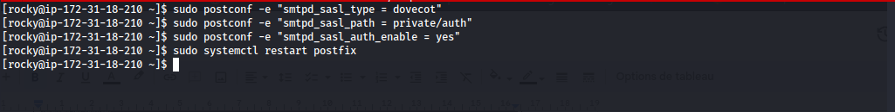
*`smtpd_sasl_type = dovecot`, `smtpd_sasl_path = private/auth`, `smtpd_sasl_auth_enable = yes`. Postfix now delegates all SASL authentication decisions to Dovecot's auth daemon via the Unix socket at `private/auth` (relative to Postfix's chroot queue directory).*

**Dovecot SASL socket configuration — `/etc/dovecot/conf.d/10-master.conf`:**

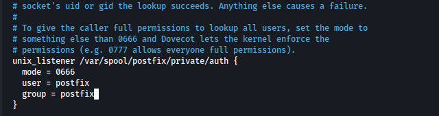
*`unix_listener /var/spool/postfix/private/auth { mode = 0666; user = postfix; group = postfix }`. Mode `0666` is required because Postfix cannot use `0600` — it runs as its own user and must have socket access. Owner and group are `postfix`, keeping the socket boundary correct. `0777` would allow all users — `0666` restricts to explicit socket connections.*

**`/etc/postfix/master.cf` — key services:**

```
# SMTP port 25 — inbound reception + outbound direct sending
smtp      inet  n       -       n       -       -       smtpd

# Submission port 587 — authenticated client relay
submission inet n       -       n       -       -       smtpd
  -o syslog_name=postfix/submission
  -o smtpd_tls_security_level=encrypt
  -o smtpd_sasl_auth_enable=yes
  -o smtpd_tls_auth_only=yes
  -o smtpd_recipient_restrictions=permit_sasl_authenticated,reject

# SMTPS port 465 — implicit TLS (no STARTTLS downgrade possible)
smtps     inet  n       -       n       -       -       smtpd
  -o syslog_name=postfix/smtps
  -o smtpd_tls_wrappermode=yes
  -o smtpd_sasl_auth_enable=yes
  -o smtpd_recipient_restrictions=permit_sasl_authenticated,reject
```

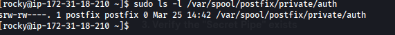
*`/var/spool/postfix/private/auth` — `srw-rw----` (660). Socket accessible to Postfix and `mail` group only — no world-readable exposure of the SASL channel.*

**SendGrid fallback relay credentials — `/etc/postfix/sasl_passwd`:**

```bash
# Store credential (used ONLY when fallback_relay activates)
echo "[smtp.sendgrid.net]:587 apikey:SG.YOUR_KEY_HERE" \
  | sudo tee /etc/postfix/sasl_passwd

# Compile to LMDB (Rocky Linux — Berkeley DB removed)
sudo postmap lmdb:/etc/postfix/sasl_passwd

# Lock down — credential file must never be world-readable
sudo chmod 0600 /etc/postfix/sasl_passwd /etc/postfix/sasl_passwd.lmdb
```

**Full relay and database configuration:**

```bash
# Leave relayhost empty — direct delivery is primary
sudo postconf -e "relayhost ="
sudo postconf -e "fallback_relay = [smtp.sendgrid.net]:587"
sudo postconf -e "smtp_sasl_auth_enable = yes"
sudo postconf -e "smtp_sasl_password_maps = lmdb:/etc/postfix/sasl_passwd"
sudo postconf -e "smtp_sasl_security_options = noanonymous"
sudo postconf -e "default_database_type = lmdb"
sudo postconf -e "alias_database = lmdb:/etc/aliases"
sudo postconf -e "alias_maps = lmdb:/etc/aliases"
```

> **Rocky Linux compatibility:** Rocky Linux 9/10 removed Berkeley DB — all `hash:` map types fail with `unsupported dictionary type: hash`. Migrating everything to `lmdb:` resolved this.

**STARTTLS local verification:**

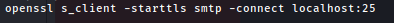
*`openssl s_client -starttls smtp -connect localhost:25` — confirms Postfix correctly advertises and negotiates STARTTLS on the local SMTP port. The full inbound TLS pipeline is verified on the server itself.*

---

### 5.6 Virtual Mailbox Configuration

Virtual mailboxes allow Postfix to deliver mail to filesystem paths for multiple users without requiring OS-level user accounts. This is a critical change from the default local delivery setup.

**Key parameters in `/etc/postfix/main.cf`:**

```ini
# Virtual mailbox setup
virtual_mailbox_domains = gwallofchina.yulcyberhub.click
virtual_mailbox_maps    = lmdb:/etc/postfix/vmailbox
virtual_mailbox_base    = /var/mail/vhosts
virtual_uid_maps        = static:5000
virtual_gid_maps        = static:5000

# CRITICAL: Domain must NOT appear in both mydestination and virtual_mailbox_domains
mydestination = $myhostname, localhost.$mydomain, localhost
```

> **Critical fix:** Removing `$mydomain` from `mydestination` was essential. A domain cannot exist in both `mydestination` and `virtual_mailbox_domains` — Postfix will reject delivery with a configuration error if both are set simultaneously.

**Virtual mailbox map — `/etc/postfix/vmailbox`:**

```
pborelli@gwallofchina.yulcyberhub.click   gwallofchina.yulcyberhub.click/pborelli/Maildir/
kbain@gwallofchina.yulcyberhub.click      gwallofchina.yulcyberhub.click/kbain/Maildir/
molivier@gwallofchina.yulcyberhub.click   gwallofchina.yulcyberhub.click/molivier/Maildir/
sroy@gwallofchina.yulcyberhub.click       gwallofchina.yulcyberhub.click/sroy/Maildir/
```

After any edit, always recompile:

```bash
sudo postmap lmdb:/etc/postfix/vmailbox
```

**Maildir provisioning** — Postfix does not create the directory structure automatically:

```bash
# Create Maildir structure for each user
sudo mkdir -p /var/mail/vhosts/gwallofchina.yulcyberhub.click/USER/Maildir/{cur,new,tmp}
sudo chown -R vmail:vmail /var/mail/vhosts/
sudo chmod -R 700 /var/mail/vhosts/

# Parent directories must remain traversable
sudo chmod 755 /var/mail
sudo chmod 755 /var/mail/vhosts
```

**Required directory permission chain:**

| Path | Owner | Permissions |
|---|---|---|
| `/var/mail` | root:mail | 755 |
| `/var/mail/vhosts` | vmail:vmail | 755 |
| `/var/mail/vhosts/domain/` | vmail:vmail | 700 |
| `/var/mail/vhosts/domain/user/` | vmail:vmail | 700 |
| `/var/mail/vhosts/domain/user/Maildir/` | vmail:vmail | 700 |
| `/var/mail/vhosts/domain/user/Maildir/new/` | vmail:vmail | 700 |

**Dovecot mail location — `/etc/dovecot/conf.d/10-mail.conf`:**

```ini
mail_location = maildir:/var/mail/vhosts/%d/%n/Maildir
```

**Dovecot authentication — `/etc/dovecot/conf.d/auth-passwdfile.conf.ext`:**

```ini
passdb {
  driver = passwd-file
  args   = scheme=SHA512-CRYPT /etc/dovecot/users
}

userdb {
  driver = static
  args   = uid=vmail gid=vmail home=/var/mail/vhosts/%d/%n
}
```

In `/etc/dovecot/conf.d/10-auth.conf`:

```ini
!include auth-passwdfile.conf.ext   # uncommented
#!include auth-system.conf.ext      # commented out — conflicts with passwd-file
```

**Dovecot user database — `/etc/dovecot/users`:**

```
user@domain:{SHA512-CRYPT}HASH:5000:5000::/var/mail/vhosts/domain/user
```

Generate a password hash with:

```bash
doveadm pw -s SHA512-CRYPT
```

---

### 5.7 Inbound Mail — Direct SMTP Reception

Inbound mail is now received directly by Postfix on port 25. The MX record points to `mail.gwallofchina.yulcyberhub.click` (EC2 instance). Port 25 is open in the security group and unblocked at the AWS account level by Oracle (instructor).

**Inbound mail flow:**

```
Sender MTA
    │
    ▼ (DNS MX lookup)
mail.gwallofchina.yulcyberhub.click:25
    │
    ▼
Postfix (smtpd) → virtual transport → Dovecot LMTP
    │
    ▼
/var/mail/vhosts/gwallofchina.yulcyberhub.click/user/Maildir/
    │
    ▼
Dovecot IMAP → Webmail or mail client
```

**Verify Postfix is listening for inbound mail:**

```bash
sudo ss -tlnp | grep :25
# Expected: LISTEN 0 100 0.0.0.0:25
```

**Watch inbound delivery in real time:**

```bash
sudo tail -f /var/log/maillog
```

> **Note:** The SendGrid Inbound Parse webhook (`/api/inbound`) remains configured as a legacy fallback path but is no longer the primary inbound route.

---

### 5.8 Webmail Application

A custom Node.js webmail application is deployed at `https://mail.gwallofchina.yulcyberhub.click`, providing browser-based mail access authenticated against Dovecot credentials.

**Stack:**

| Component | Technology |
|---|---|
| Runtime | Node.js 20 |
| Framework | Express |
| IMAP client | imapflow |
| SMTP send | Nodemailer (via Postfix localhost:25) |
| Mail parsing | mailparser |
| File upload / webhook | multer |
| Process manager | PM2 (runs as root) |

**File structure:**

```
/opt/webmail/
├── server.js          ← Express backend
├── package.json       ← Dependencies
├── node_modules/      ← Auto-generated by npm install
└── public/
    └── index.html     ← Frontend UI
```

**Looking at the app**

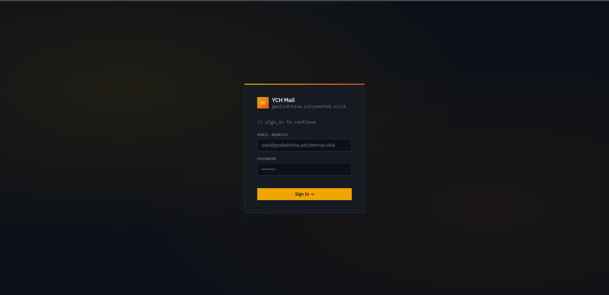

**Installation:**

```bash
# Node.js 20
sudo dnf module enable nodejs:20 -y
sudo dnf install nodejs -y

# App dependencies
cd /opt/webmail
npm install

# PM2 — must run as root for vmail directory access
sudo npm install -g pm2
sudo /usr/local/bin/pm2 start /opt/webmail/server.js --name webmail
sudo /usr/local/bin/pm2 save
sudo /usr/local/bin/pm2 startup
```

> **PM2 must run as root** because the Node.js process needs write access to `/var/mail/vhosts/` (owned by `vmail`, uid 5000) when the inbound webhook delivers messages. Non-root PM2 instances will fail silently on inbound delivery.

**Features:**

- Login via Dovecot IMAP credentials (full email address as username)
- Read, send, reply, forward, and delete email
- Folder switching (Inbox, Sent, Drafts, Trash, Spam)
- Unread badge count and client-side search
- Sessions persist for 8 hours with random session secret via environment variable

---

### 5.9 SPF / DKIM / DMARC / MTA-STS

**SPF — Soft Fail (includes SendGrid for fallback):**

```dns
@ TXT "v=spf1 ip4:54.226.198.180 include:sendgrid.net mx ~all"
```

`ip4:54.226.198.180` authorizes direct sending from the EC2 server. `include:sendgrid.net` authorizes SendGrid when the fallback relay activates. `~all` is a soft fail — stricter than nothing but allows DMARC to make the final enforcement decision via `p=reject`.

**DKIM — Two signing paths:**

*Local signing via OpenDKIM (direct send — primary):*

```dns
mail._domainkey  TXT  "v=DKIM1; k=rsa; p=<public key>"
```

OpenDKIM signs every outbound message before it leaves Postfix, using selector `mail`. This is what allows direct SMTP delivery to pass DMARC without going through SendGrid.

*CNAME delegation to SendGrid (fallback relay):*

```dns
s1._domainkey  CNAME  s1.domainkey.u61568083.wl084.sendgrid.net
s2._domainkey  CNAME  s2.domainkey.u61568083.wl084.sendgrid.net
em5287         CNAME  u61568083.wl084.sendgrid.net
```

CNAME-based DKIM allows SendGrid to rotate 2048-bit RSA keys automatically without requiring manual DNS updates. These selectors are only used when the `fallback_relay` activates.

**DMARC — Strict reject policy:**

```dns
_dmarc TXT "v=DMARC1; p=reject; rua=mailto:admin@gwallofchina.yulcyberhub.click; ruf=mailto:admin@gwallofchina.yulcyberhub.click; sp=reject; adkim=s; aspf=s"
```

| Parameter | Effect |
|---|---|
| `p=reject` | Failed messages dropped at gateway — no quarantine |
| `sp=reject` | Subdomains inherit the same reject policy |
| `adkim=s` | DKIM `d=` must exactly match `From:` domain |
| `aspf=s` | SPF envelope sender must exactly match `From:` domain |
| `rua` + `ruf` | Aggregate + forensic failure reports to admin |

**MTA-STS & TLS-RPT:**

```dns
_mta-sts  TXT  "v=STSv1; id=20260403000000"
_smtp._tls TXT  "v=TLSRPTv1; rua=mailto:admin@gwallofchina.yulcyberhub.click"
```

MTA-STS prevents SMTP MitM downgrade attacks by requiring TLS with a valid certificate. TLS-RPT reports any encryption failures or downgrade attempts.

**MTA-STS policy file** — served at `https://mta-sts.gwallofchina.yulcyberhub.click/.well-known/mta-sts.txt`:

```
version: STSv1
mode: enforce
mx: mail.gwallofchina.yulcyberhub.click
max_age: 86400
```

**Nginx virtual host** (`/etc/nginx/conf.d/mta-sts.conf`):

```nginx
server {
    listen 80;
    listen [::]:80;
    server_name mta-sts.gwallofchina.yulcyberhub.click;
    return 301 https://$host$request_uri;
}

server {
    listen 443 ssl;
    listen [::]:443 ssl;
    http2 on;
    server_name mta-sts.gwallofchina.yulcyberhub.click;

    ssl_certificate     /etc/letsencrypt/live/gwallofchina.yulcyberhub.click/fullchain.pem;
    ssl_certificate_key /etc/letsencrypt/live/gwallofchina.yulcyberhub.click/privkey.pem;
    ssl_protocols TLSv1.2 TLSv1.3;

    root /var/www/mta-sts;

    location = /.well-known/mta-sts.txt {
        default_type text/plain;
        try_files $uri =404;
    }

    location / {
        return 404;
    }
}
```

**Verify:**

```bash
curl https://mta-sts.gwallofchina.yulcyberhub.click/.well-known/mta-sts.txt
```

---

### 5.10 Adding a New User

```bash
# 1. Add to Postfix virtual mailbox map
echo "user@gwallofchina.yulcyberhub.click  gwallofchina.yulcyberhub.click/user/Maildir/" \
  | sudo tee -a /etc/postfix/vmailbox

# 2. Recompile the map
sudo postmap lmdb:/etc/postfix/vmailbox

# 3. Create the Maildir structure
sudo mkdir -p /var/mail/vhosts/gwallofchina.yulcyberhub.click/user/Maildir/{cur,new,tmp}
sudo chown -R vmail:vmail /var/mail/vhosts/
sudo chmod -R 700 /var/mail/vhosts/

# 4. Fix parent directory permissions (required for traversal)
sudo chmod 755 /var/mail
sudo chmod 755 /var/mail/vhosts

# 5. Generate password hash and add to Dovecot
doveadm pw -s SHA512-CRYPT   # enter password when prompted, copy the hash output
echo "user@gwallofchina.yulcyberhub.click:{SHA512-CRYPT}HASH:5000:5000::/var/mail/vhosts/gwallofchina.yulcyberhub.click/user" \
  | sudo tee -a /etc/dovecot/users

# 6. Reload services
sudo systemctl reload postfix dovecot

# 7 Automation (can be found in scripts)
sudo ./mail-admin.sh add <user>
```

---

### 5.11 Client Mail App Settings

For connecting any standard IMAP/SMTP mail client (Thunderbird, Outlook, iOS Mail, etc.):

| Setting | Value |
|---|---|
| IMAP Server | `mail.gwallofchina.yulcyberhub.click` |
| IMAP Port | `993` (SSL/TLS) |
| SMTP Server | `mail.gwallofchina.yulcyberhub.click` |
| SMTP Port | `587` (STARTTLS) |
| Username | Full email address (e.g. `<user>@gwallofchina.yulcyberhub.click`) |
| Password | Set with `doveadm pw` |

---

### 5.12 Sendgrid fallback mechanisms, Webmail Interactions and final configuration files.
The Postfix configurations are set to act as its own master mailer first. and only uses
Sendgrid as the fallback if it cannot rech the destinattion
    
    # Direct sending (Empty relayhost forces MX lookups)
    relayhost = 
    
    # SendGrid Fallback (Triggered only on connection failure)
    fallback_relay = [smtp.sendgrid.net]:587

**How the fallback Works:**
1. **Step 1 (Direct):** When you send an email, Postfix looks up the **MX record** of the recipient (e.g., Gmail). It attempts to connect to Gmail's server on **port 25**.
2.  **Step 2 (The Trigger):** if port 25 is blocked by the ISP, AWS, or if the recipient server id down,  postfix triggets the **fallback_relay**. To maximize availability to our current infrastructure users, and future clients.
3.  **Step 3 (The Handshake):** Postfix connect to **smtp.sendgrid.net** on **port 587**. it presents the API key stored in **/etc/postfix/sasl_passwd** to prive is is an authorized sender.
4.  **Step 4 (Delivery):** SendGrid accepts the mail and delivers it on your behalf.

**Webmail Interactions: the "Secret Pipe"**:
The Webmail app does not talk to the mailbox files directly it talks to **dovecot** via the **IMAPS** protocol.
**Authentication Path**
When a user logs into the webmail:
1. **Credential Check:** The webmail sends the username/password to Dovecot.
2. **The Source of Truth:** Dovecot looks at the managed file: **/etc/dovecot/users**.
3. **The Hash:** It compared the provided password againts the **SHA512-CRYPT** hash we manualy insert, or via the script that manages users **mail-admin.sh**.

**Configuration in auth-passwdfile.conf.ext**

    passdb {
      driver = passwd-file
      args = scheme=CRYPT username_format=%u /etc/dovecot/users
    }
    
    userdb {
      driver = passwd-file
      args = username_format=%u /etc/dovecot/users
    }

**Final configuration files for Webmail/Email Server configurations:**
1. **The Traffic Controller:** /etc/postfix/main.cf
This is the most critical file. It defines the "Direct-First" logic and points Postfix to your security certificates.
- **Key Parameters:**
    - relayhost = (must be empty for direct sending).
    - fallback_relay = [smtp.sendgrid.net:587 (the safety net).
    - smtpd_tls_cert_file / key_file (points to the lets encrypt SAN certs).
    - virtual_mailbox_domains & virtual_mailbox_maps (Points to our domain and LMDB file).
 
```properties
# --- Hostname and Domain Settings ---
myhostname = mail.gwallofchina.yulcyberhub.click
mydomain = gwallofchina.yulcyberhub.click
myorigin = $mydomain
inet_interfaces = all
inet_protocols = ipv4

# --- Destination and Relay ---
# CRITICAL: Since you are using virtual_mailbox_domains, 
# your domain SHOULD NOT be in mydestination.
mydestination = $myhostname, localhost.$mydomain, localhost

# Direct sending with SendGrid fallback
relayhost = 
fallback_relay = [smtp.sendgrid.net]:587

# SendGrid Auth
smtp_sasl_auth_enable = yes
smtp_sasl_password_maps = lmdb:/etc/postfix/sasl_passwd
smtp_sasl_security_options = noanonymous
smtp_use_tls = yes
smtp_tls_security_level = may
smtp_tls_loglevel = 1

# Transport map
transport_maps = lmdb:/etc/postfix/transport

# --- Rate Limiting (1 email/min) ---
smtp_destination_rate_delay = 60s
default_destination_rate_delay = 60s
smtp_destination_concurrency_limit = 1
default_destination_concurrency_limit = 1
smtp_extra_recipient_limit = 1
minimal_backoff_time = 60s
maximal_backoff_time = 120s

# --- Virtual Mailbox Settings ---
virtual_mailbox_domains = gwallofchina.yulcyberhub.click
virtual_mailbox_base = /var/mail/vhosts
virtual_mailbox_maps = lmdb:/etc/postfix/vmailbox
virtual_transport = lmtp:unix:private/dovecot-lmtp

# Virtual User IDs (vmail)
virtual_minimum_uid = 100
virtual_uid_maps = static:5000
virtual_gid_maps = static:5000

# --- SSL/TLS Settings (A+ Grade) ---
smtpd_tls_cert_file = /etc/letsencrypt/live/gwallofchina.yulcyberhub.click/fullchain.pem
smtpd_tls_key_file = /etc/letsencrypt/live/gwallofchina.yulcyberhub.click/privkey.pem
smtpd_tls_security_level = may
smtpd_tls_auth_only = yes
smtpd_tls_mandatory_protocols = !SSLv2, !SSLv3, !TLSv1, !TLSv1.1
smtpd_tls_protocols = !SSLv2, !SSLv3, !TLSv1, !TLSv1.1
tls_preempt_cipherlist = yes

# --- Dovecot SASL Authentication ---
smtpd_sasl_type = dovecot
smtpd_sasl_path = private/auth
smtpd_sasl_auth_enable = yes
smtpd_recipient_restrictions = permit_mynetworks, permit_sasl_authenticated, reject_unauth_destination
mynetworks = 127.0.0.0/8 54.226.198.180/32

# --- Database Types ---
default_database_type = lmdb
compatibility_level = 3.6
milter_default_action = accept
milter_protocol = 6
smtpd_milters = inet:localhost:8891
non_smtpd_milters = inet:localhost:8891
alias_maps = lmdb:/etc/aliases
alias_database = lmdb:/etc/aliases

```
2. **The Delivery Instructions:** /etc/postfix/master.cf
This file manages how different services (SMTP, Submission, SMTPS) behaves.
- **Key Sections to Verify:**
    - **Submission (587): Must have smtpd_sasl_auth_enable=yes so the webmail can send mail.
    - **Custom Transports:** Ensure the direct-smtp and sendgrid transports are defined at the bottom for the rate-limiting required by AWS.

```properties
#
# Postfix master process configuration file.  For details on the format
# of the file, see the master(5) manual page (command: "man 5 master" or
# on-line: http://www.postfix.org/master.5.html).
#
# Do not forget to execute "postfix reload" after editing this file.
#
# ==========================================================================
# service type  private unpriv  chroot  wakeup  maxproc command + args
#               (yes)   (yes)   (no)    (never) (100)
# ==========================================================================
smtp      inet  n       -       n       -       -       smtpd
#smtp      inet  n       -       n       -       1       postscreen
#smtpd     pass  -       -       n       -       -       smtpd
#dnsblog   unix  -       -       n       -       0       dnsblog
#tlsproxy  unix  -       -       n       -       0       tlsproxy

# Submission port 587 — authenticated relay (clients sending outbound mail)
submission inet n       -       n       -       -       smtpd
  -o syslog_name=postfix/submission
  -o smtpd_tls_security_level=encrypt
  -o smtpd_sasl_auth_enable=yes
  -o smtpd_tls_auth_only=yes
  -o smtpd_recipient_restrictions=permit_sasl_authenticated,reject

# SMTPS port 465 — implicit TLS (no STARTTLS downgrade possible)
smtps     inet  n       -       n       -       -       smtpd
  -o syslog_name=postfix/smtps
  -o smtpd_tls_wrappermode=yes
  -o smtpd_sasl_auth_enable=yes
  -o smtpd_recipient_restrictions=permit_sasl_authenticated,reject

#628       inet  n       -       n       -       -       qmqpd
pickup    unix  n       -       n       60      1       pickup
cleanup   unix  n       -       n       -       0       cleanup
qmgr      unix  n       -       n       300     1       qmgr
#qmgr     unix  n       -       n       300     1       oqmgr
tlsmgr    unix  -       -       n       1000?   1       tlsmgr
rewrite   unix  -       -       n       -       -       trivial-rewrite
bounce    unix  -       -       n       -       0       bounce
defer     unix  -       -       n       -       0       bounce
trace     unix  -       -       n       -       0       bounce
verify    unix  -       -       n       -       1       verify
flush     unix  n       -       n       1000?   0       flush
proxymap  unix  -       -       n       -       -       proxymap
proxywrite unix -       -       n       -       1       proxymap
smtp      unix  -       -       n       -       -       smtp
relay     unix  -       -       n       -       -       smtp
        -o syslog_name=postfix/$service_name
#       -o smtp_helo_timeout=5 -o smtp_connect_timeout=5
showq     unix  n       -       n       -       -       showq
error     unix  -       -       n       -       -       error
retry     unix  -       -       n       -       -       error
discard   unix  -       -       n       -       -       discard
local     unix  -       n       n       -       -       local
virtual   unix  -       n       n       -       -       virtual
lmtp      unix  -       -       n       -       -       lmtp
anvil     unix  -       -       n       -       1       anvil
scache    unix  -       -       n       -       1       scache
postlog   unix-dgram n  -       n       -       1       postlogd

# ====================================================================
# Custom transports — Direct sending + SendGrid relay
# Rate limited to 1 email/min each
# ====================================================================

direct-smtp  unix  -  -  n  -  1  smtp
    -o smtp_destination_rate_delay=60s
    -o smtp_destination_concurrency_limit=1
    -o smtp_extra_recipient_limit=1

sendgrid     unix  -  -  n  -  1  smtp
    -o smtp_destination_rate_delay=60s
    -o smtp_destination_concurrency_limit=1
    -o smtp_extra_recipient_limit=1
    -o smtp_sasl_auth_enable=yes
    -o relayhost=[smtp.sendgrid.net]:587
    -o smtp_sasl_password_maps=lmdb:/etc/postfix/sasl_passwd
    -o smtp_sasl_security_options=noanonymous

```
3. **The Secret Vault:** /etc/postfix/sasl_passwd
This file contains the "handshake" credentials for SendGrid.
- **Action Required:**
    - Must contain: [smtp.sendgrid.net]:587 apikey:SG.<REDACTED>
    - **CRITICAL:** Must be compiled into LMDB format using: sudo postmap lmdv:/etc/postfix/sasl_passwd, every time the API key changes.
    - Because of the information disclosure risk i will not be including the file.
 
4. **THe User Database:** /etc/dovecot/users
This is the file the script mail-admin.sh manages, notes the permisisons and the setup these are virtual users.
- **Format Check:**
    - Each line must follow the user@domain:{HASH}:5000:5000::/path format.
    - **Security:** Ensure it uses  {SHA512-CRYPT} to maintain the A+ security rathing.

5. **The Auth Bridge:** /etc/dovecot/conf.d/auth-passwdfile.conf.ext
This file tells the Dovecot service how to read the users file mentioned above.
- **Configuration Check:**
    - passdb and userdb sections must both point to args = etc/dovecot/users.
    - Without this file being correctly configured and included in 10-auth.conf, Dovecot won't know where to look for the users you add with the script.

---

### 5.13 Verification

**IMAPS (Port 993):**

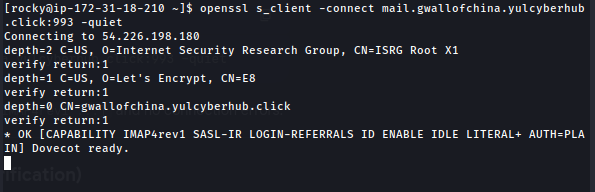
*`openssl s_client -connect mail.gwallofchina.yulcyberhub.click:993 -quiet` from Rocky Linux — full chain ISRG Root X1 → E8 → domain. `* OK [...] Dovecot ready.`*

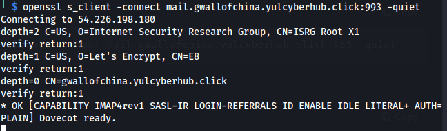
*Same command from Kali — identical chain and Dovecot IMAP4rev1 banner. Cross-platform validation.*

**SMTPS (Port 465):**

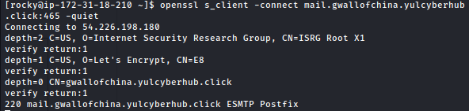
*`openssl s_client -connect mail.gwallofchina.yulcyberhub.click:465 -quiet` from Rocky Linux — full chain verified. `220 mail.gwallofchina.yulcyberhub.click ESMTP Postfix` banner.*

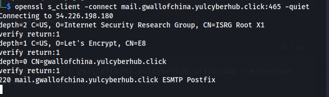
*Same from Kali — identical chain and `220 ESMTP Postfix` banner. Confirms port 465 serves correct implicit TLS from any external client.*

**Mailbox verification commands:**

| Task | Command |
|---|---|
| Check Postfix mapping | `postmap -q user@domain lmdb:/etc/postfix/vmailbox` |
| Test Dovecot auth | `sudo doveadm auth test user@domain 'password'` |
| Check Dovecot user | `sudo doveadm user user@domain` |
| Watch live mail logs | `sudo tail -f /var/log/maillog` |
| Check PM2 processes | `sudo /usr/local/bin/pm2 list` |
| Check Node app logs | `sudo /usr/local/bin/pm2 logs webmail` |
| Check MX record | `dig MX gwallofchina.yulcyberhub.click` |
| List mailboxes | `sudo cat /etc/postfix/vmailbox` |
| List Dovecot users | `sudo cat /etc/dovecot/users` |
| Check mail folders | `sudo ls /var/mail/vhosts/gwallofchina.yulcyberhub.click/` |
| Verify relay config | `postconf relayhost fallback_relay` |

**End-to-End Mail Delivery:**

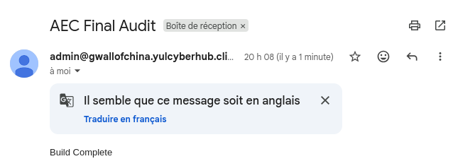
*Gmail inbox — "AEC Final Audit" received from `admin@gwallofchina.yulcyberhub.click`. Confirms end-to-end mail delivery is operational and the domain identity is trusted by Google's mail infrastructure.*

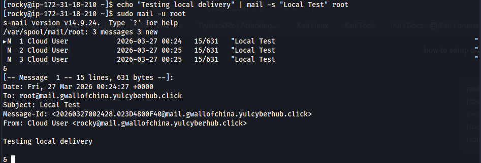
*Local delivery test: three messages in `/var/spool/mail/root`, `From: Cloud User <rocky@mail.gwallofchina.yulcyberhub.click>`. Postfix local transport confirmed.*

**Receiving Mail Via Webmail App**
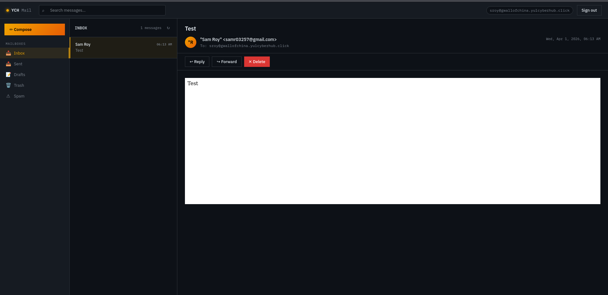

**Verifying DMARC, DKIM, SPF, MTA-STS:**
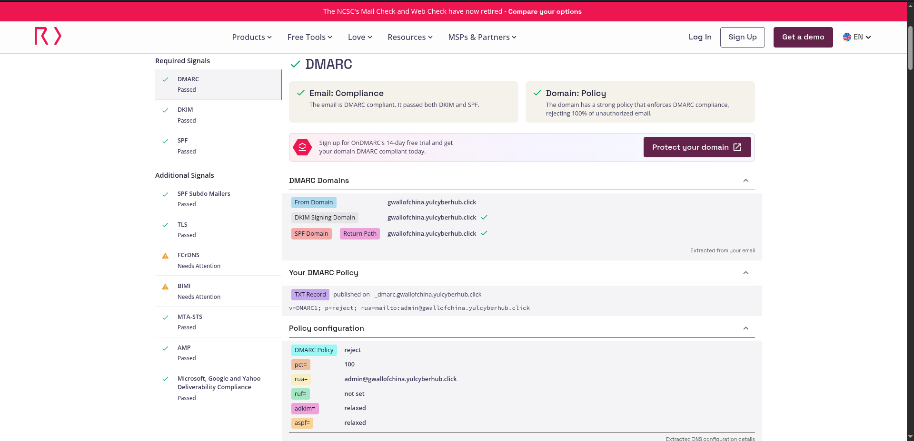

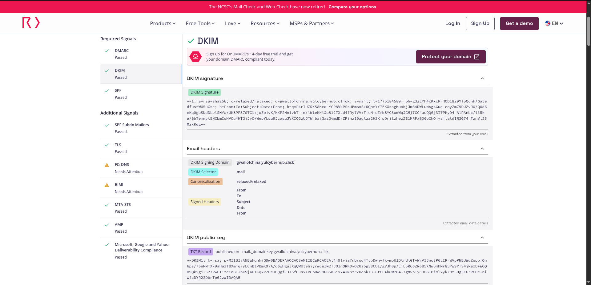

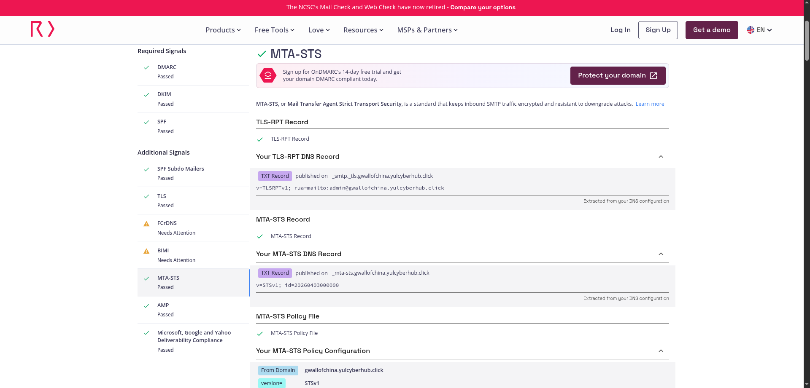

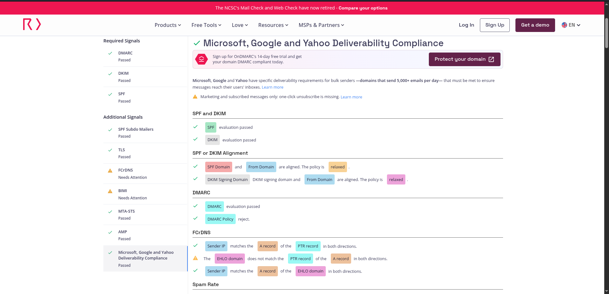

**SSL Labs A+ — Mail Server:**

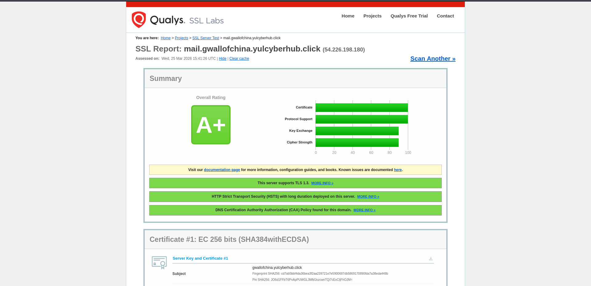
*Qualys SSL Labs — `mail.gwallofchina.yulcyberhub.click` (54.226.198.180): **A+**. TLS 1.3, HSTS long-duration, CAA policy found. Certificate: EC 256 bits, SHA384withECDSA.*


*Detailed SSL Labs mail report — identical A+ rating. Certificate fingerprint and SAN confirm shared cert with main domain. Certificate Transparency: Yes.*

---

## Phase 6 — Challenges & Trade-Offs

### 6.1 Security vs. Compatibility

**Disabling TLS 1.0 / 1.1**

Disabling legacy protocols impacts ≤2% of clients (IE11 on Windows 7, unsupported since 2020). Accepted because the affected population runs unpatched software that presents greater ecosystem risk than the accessibility loss.

**CSP `unsafe-inline`**

`style-src` and `script-src` include `'unsafe-inline'` — required by the current page architecture. Planned migration to nonce-based CSP (`'nonce-{random}'`) will address this without breaking inline functionality.

**SSH Port 22**

Open to `0.0.0.0/0` alongside the team IP for lab operational flexibility. Explicitly documented as a known limitation — production requires bastion-only restriction.

---

### 6.2 Performance Considerations

**DH Parameter Generation:**
4096-bit DH parameter generation takes 10–20 minutes on t4g.small — one-time cost, not per-connection. Security gain (Logjam mitigation) far outweighs the delay.

**TLS Session Cache:**
10MB shared cache (~40,000 sessions) reduces handshake overhead on returning clients while `ssl_session_tickets off` preserves PFS.

**HTTP/2:**
HPACK header compression and multiplexed requests reduce page load latency without security trade-offs. Confirmed: `[PASS] HTTP/2: active`.

**ChaCha20-Poly1305:**
Included specifically for the ARM64 Graviton2 processor — on hardware without AES-NI, ChaCha20 outperforms AES-GCM in software. Both Nginx and Postfix benefit from this cipher being in the priority list.

---

### 6.3 Testing & Troubleshooting

**Issues Encountered and Resolutions:**

| Issue | Root Cause | Resolution |
|---|---|---|
| `unsupported dictionary type: hash` | Rocky Linux 9/10 removed Berkeley DB | Migrated all `hash:` maps to `lmdb:` |
| Lynis download redirect failure | Vendor CDN issue in Rocky 10 | Used GitHub tar.gz with `curl -L` |
| DNSSEC — no `ad` flag | Oracle had not yet inserted DS record into parent zone | Waited for Oracle; CAA + CT as interim controls |
| DNSSEC — KMS permissions error | Initial CMK policy did not grant Route 53 `DescribeKey`, `GetPublicKey`, `Sign` | Updated key policy to include `route53.amazonaws.com` as principal |
| Certificate permission denied (Postfix/Dovecot) | `/etc/letsencrypt` root-owned only | `ssl-cert` group + `chmod 750` + `g+s` sticky bit |
| Nginx zombie processes on restart | Improper restart sequence | `pkill -9 nginx` before `systemctl start nginx` |
| Webmail showing castle page | `gwallofchina.conf` catching all traffic | Separate `server_name` per Nginx config file |
| Certbot failing on webmail | `webmail.conf` had wrong cert path | Updated to use shared SAN cert path |
| SendGrid webhook returning 404 | `express.json()` consuming body before `multer` | Moved `/api/inbound` route before all middleware |
| Maildir not found | Folders not created automatically by Postfix | `mkdir -p .../Maildir/{cur,new,tmp}` |
| Permission denied writing mail | PM2 running as `rocky` user, not root | Switched to `sudo /usr/local/bin/pm2` |
| Dovecot permission denied on `/var/mail` | `/var/mail` set to 700 | `chmod 755 /var/mail && chmod 755 /var/mail/vhosts` |
| `mydestination` + `virtual_mailbox_domains` conflict | Domain listed in both directives | Removed `$mydomain` from `mydestination` |
| Direct send rejected by Gmail (`5.7.26 DMARC`) | Mail sent without DKIM signature — SendGrid DKIM only covers SendGrid-relayed mail | Installed OpenDKIM milter for local signing |
| OpenDKIM exit code 78 on startup | `TrustAnchorFile` path does not exist on Rocky Linux 10 | Removed `TrustAnchorFile` line from `opendkim.conf` |
| `signing table references unknown key` | KeyTable file was empty — `tee` wrote entry to SigningTable instead | Rewrote both SigningTable and KeyTable with correct single-line entries |
| `multiple DNS replies` for DKIM key | DNS record stored as 3 separate ResourceRecords instead of one value with quoted chunks | Deleted and recreated record as single value with space-separated quoted chunks |
| `CharacterStringTooLong` when adding DKIM TXT | Full key exceeds 255-char DNS TXT string limit | Split key into multiple quoted chunks within a single ResourceRecord value |
| SPF fail on direct-sent mail | Two conflicting SPF records (`v=spf1 -all` and correct record) | Deleted `v=spf1 -all` record; kept `v=spf1 ip4:54.226.198.180 include:sendgrid.net mx ~all` |
| Port 465 (SMTPS) not listening | `smtps` service missing from `master.cf` | Added `smtps inet n - n - - smtpd` block with `-o smtpd_tls_wrappermode=yes` |
| `master.cf` sed corrupted submission block | `sed -i` merged multi-line block into one line | Rewrote `master.cf` manually with correct indentation for each `-o` option |
| MTA-STS policy file missing | Policy file not created on server | Created `/var/www/mta-sts/.well-known/mta-sts.txt` and added Nginx virtual host |
| MTA-STS subdomain no certificate | `mta-sts.gwallofchina.yulcyberhub.click` not in SAN cert | Expanded cert with `certbot --expand -d mta-sts.gwallofchina.yulcyberhub.click` |

**Full validation command set:**

```bash
# 1. HTTP → HTTPS redirect
curl -I http://gwallofchina.yulcyberhub.click

# 2. TLS handshake + certificate chain
openssl s_client -connect gwallofchina.yulcyberhub.click:443 \
  -servername gwallofchina.yulcyberhub.click | head -20

# 3. Legacy protocol rejection
openssl s_client -connect gwallofchina.yulcyberhub.click:443 -tls1_1
# Expected: handshake failure

# 4. IMAPS
openssl s_client -connect mail.gwallofchina.yulcyberhub.click:993 -quiet

# 5. SMTPS
openssl s_client -connect mail.gwallofchina.yulcyberhub.click:465 -quiet

# 6. DNSSEC
dig +dnssec MX gwallofchina.yulcyberhub.click
delv @1.1.1.1 gwallofchina.yulcyberhub.click
# Look for: 'ad' flag + '; fully validated'

# 7. End-to-end mail
echo "Build Complete" | mail -s "AEC Final Audit" \
  -r admin@gwallofchina.yulcyberhub.click recipient@example.com

# 8. Automated Nginx verification
sudo ./nginx_verify3.0.sh

# 9. Postfix virtual mailbox lookup
postmap -q sroy@gwallofchina.yulcyberhub.click lmdb:/etc/postfix/vmailbox

# 10. Dovecot auth test
sudo doveadm auth test sroy@gwallofchina.yulcyberhub.click 'password'

# 11. Check webmail process
sudo /usr/local/bin/pm2 list

# 12. Verify outbound relay configuration
postconf relayhost fallback_relay
# Expected: relayhost = (empty)   fallback_relay = [smtp.sendgrid.net]:587

# 13. Verify OpenDKIM is running and wired to Postfix
sudo systemctl status opendkim
ss -tlnp | grep 8891
postconf smtpd_milters non_smtpd_milters

# 14. Verify DKIM key in DNS
sudo opendkim-testkey -d gwallofchina.yulcyberhub.click -s mail -vvv
# Expected: key OK

# 15. Full auth verification (port25 auto-reply)
echo "auth test" | mail -s "auth test" check-auth@verifier.port25.com
# Check reply at https://mail.gwallofchina.yulcyberhub.click for SPF/DKIM/DMARC results

# 16. MTA-STS policy file
curl https://mta-sts.gwallofchina.yulcyberhub.click/.well-known/mta-sts.txt

# 17. All ports listening
sudo ss -tlnp | grep -E ':(25|465|587|993)'
# Expected: all four ports listening
```

**Final SSL Labs Summary:**

| Domain | Overall | Certificate | Protocol | Key Exchange | Cipher |
|---|---|---|---|---|---|
| `gwallofchina.yulcyberhub.click` | **A+** | 100 | 100 | 100 | 100 |
| `mail.gwallofchina.yulcyberhub.click` | **A+** | 100 | 100 | ~90 | ~90 |

**Final Deployment Status:**

| Component | Status |
|---|---|
| Outbound mail — direct SMTP (primary) | ✅ Working (`relayhost =` empty · OpenDKIM signs · port 25 open) |
| Outbound mail — SendGrid relay (fallback) | ✅ Configured (`fallback_relay = [smtp.sendgrid.net]:587`) |
| Inbound mail — direct SMTP (port 25) | ✅ Working (MX → `mail.gwallofchina.yulcyberhub.click:25`) |
| OpenDKIM local DKIM signing | ✅ Active (`s=mail` · `DKIM-Signature field added` confirmed in logs) |
| SPF | ✅ Pass (`ip4:54.226.198.180 include:sendgrid.net mx ~all`) |
| DKIM | ✅ Pass (direct: OpenDKIM `mail._domainkey` · fallback: SendGrid `s1/s2._domainkey`) |
| DMARC | ✅ Pass (`p=reject` · both paths satisfy alignment) |
| MTA-STS | ✅ Policy file live at `https://mta-sts.gwallofchina.yulcyberhub.click/.well-known/mta-sts.txt` |
| Port 25 (SMTP) | ✅ Listening — inbound + outbound |
| Port 465 (SMTPS) | ✅ Listening — implicit TLS |
| Port 587 (Submission) | ✅ Listening — STARTTLS |
| Port 993 (IMAPS) | ✅ Listening — implicit TLS |
| Dovecot IMAP | ✅ Working |
| Webmail app | ✅ Live at `https://mail.gwallofchina.yulcyberhub.click` |
| SSL certificate | ✅ Valid until 2026-07-02 (SAN: main + mail + mta-sts) |
| Main website | ✅ Live at `https://gwallofchina.yulcyberhub.click` |
| User mailboxes | ✅ pborelli, kbain, molivier, sroy |
| DNSSEC | ✅ Fully validated (chain established · `ad` flag confirmed) |

---

## References

| # | Author(s) | Title | Type | Year | URL |
|---|-----------|-------|------|------|-----|
| [1] | Mozilla Foundation | Mozilla SSL Configuration Generator | Tool | 2024 | https://ssl-config.mozilla.org |
| [2] | Qualys, Inc. | SSL Labs Server Test | Tool | 2024 | https://www.ssllabs.com/ssltest/ |
| [3] | E. Rescorla | The Transport Layer Security (TLS) Protocol Version 1.3 — RFC 8446 | RFC | 2018 | https://datatracker.ietf.org/doc/html/rfc8446 |
| [4] | K. Moriarty and S. Farrell | Deprecating TLS 1.0 and TLS 1.1 — RFC 8996 | RFC | 2021 | https://datatracker.ietf.org/doc/html/rfc8996 |
| [5] | M. Kucherawy and E. Zwicky | Domain-based Message Authentication, Reporting, and Conformance (DMARC) — RFC 7489 | RFC | 2015 | https://datatracker.ietf.org/doc/html/rfc7489 |
| [6] | D. Margolis et al. | SMTP Service Extension for Strict Transport Security (MTA-STS) — RFC 8461 | RFC | 2018 | https://datatracker.ietf.org/doc/html/rfc8461 |
| [7] | P. Hallam-Baker et al. | DNS Certification Authority Authorization (CAA) Resource Record — RFC 8659 | RFC | 2019 | https://datatracker.ietf.org/doc/html/rfc8659 |
| [8] | R. Arends et al. | DNS Security Introduction and Requirements — RFC 4033 | RFC | 2005 | https://datatracker.ietf.org/doc/html/rfc4033 |
| [9] | Let's Encrypt | Let's Encrypt Documentation | Docs | 2024 | https://letsencrypt.org/docs/ |
| [10] | Electronic Frontier Foundation | Certbot Documentation | Docs | 2024 | https://certbot.eff.org/docs/ |
| [11] | K. McKay et al. | Guidelines for the Selection, Configuration, and Use of TLS Implementations — NIST SP 800-52 Rev. 2 | Standard | 2019 | https://csrc.nist.gov/publications/detail/sp/800-52/rev-2/final |
| [12] | D. Adrian et al. | Imperfect Forward Secrecy: How Diffie-Hellman Fails in Practice (Logjam Attack) | Research | 2015 | https://weakdh.org |
| [13] | B. Möller, T. Duong, and K. Kotowicz | This POODLE Bites: Exploiting The SSL 3.0 Fallback | Research | 2014 | https://www.openssl.org/~bodo/ssl-poodle.pdf |
| [14] | T. Duong and J. Rizzo | Here Come The ⊕ Ninjas (BEAST Attack) | Research | 2011 | https://nvd.nist.gov/vuln/detail/CVE-2011-3389 |
| [15] | Chromium Project | HSTS Preload List Submission | Web | 2024 | https://hstspreload.org |
| [16] | CISofy | Lynis Security Auditing Tool | Tool | 2024 | https://github.com/CISofy/lynis |
| [17] | ByteNess | aws-vault | Tool | 2024 | https://github.com/ByteNess/aws-vault |
| [18] | Sandia National Laboratories | DNSViz DNSSEC Visualizer | Tool | 2024 | https://dnsviz.net |
| [19] | S. Roy, P. Vorperian | Project Scripts Repository | Code | 2024 | https://github.com/mrblue223/CyberSecurity_School_Labs/tree/main/Optimizing_SSL_Certificates/scripts |
| [20] | Nginx | Module ngx_http_ssl_module | Docs | 2024 | https://nginx.org/en/docs/http/ngx_http_ssl_module.html |
| [21] | W. Venema | Postfix TLS Support | Docs | 2024 | https://www.postfix.org/TLS_README.html |
| [22] | Dovecot | Dovecot SSL Configuration | Docs | 2024 | https://doc.dovecot.org/configuration_manual/dovecot_ssl_configuration/ |
| [23] | Twilio SendGrid | DKIM Records | Docs | 2024 | https://docs.sendgrid.com/ui/account-and-settings/dkim-records |
| [24] | Amazon Web Services | Configuring DNSSEC signing in Amazon Route 53 | Docs | 2024 | https://docs.aws.amazon.com/Route53/latest/DeveloperGuide/dns-configuring-dnssec.html |
| [25] | Amazon Web Services | Key policies in AWS KMS | Docs | 2024 | https://docs.aws.amazon.com/kms/latest/developerguide/key-policies.html |
| [26] | Node.js Foundation | Node.js 20 Documentation | Docs | 2024 | https://nodejs.org/en/docs/ |
| [27] | PM2 | PM2 Process Manager Documentation | Docs | 2024 | https://pm2.keystone.io/docs/ |
| [28] | Twilio SendGrid | Inbound Parse Webhook | Docs | 2024 | https://docs.sendgrid.com/for-developers/parsing-email/inbound-email |
| [29] | W. Venema | Postfix Virtual Mailbox Hosting | Docs | 2024 | https://www.postfix.org/VIRTUAL_README.html |
| [30] | The OpenDKIM Project | OpenDKIM Documentation | Docs | 2024 | http://www.opendkim.org/docs.html |
| [31] | The OpenDKIM Project | opendkim.conf(5) man page | Docs | 2024 | http://www.opendkim.org/opendkim.conf.5.html |
| [32] | IETF | MTA-STS Policy File Specification — RFC 8461 | RFC | 2018 | https://datatracker.ietf.org/doc/html/rfc8461 |

---

*Next Review: 2026-06-25 (Quarterly Security Assessment)*  
*Distribution: Cyber Defense Team · Operations Center · Compliance Office*

---


*"Security is not a product, but a process."* — Bruce Schneier
