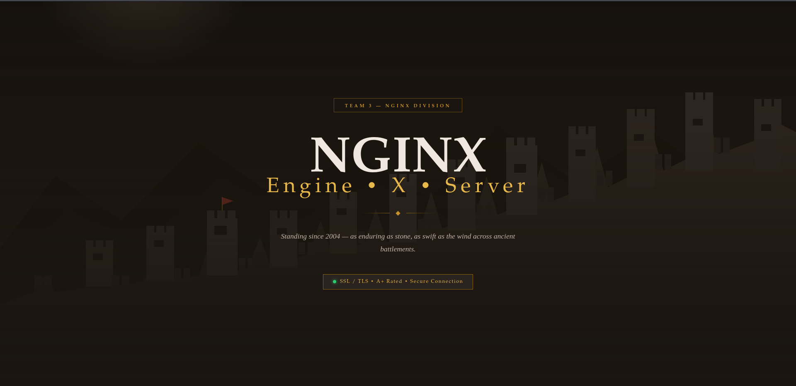

# 🔐 Optimizing SSL/TLS Certificates for Nginx & Postfix

> **Author:** Sammy Roy · **Cohort:** MEQ7 · **Team:** Team 3  
> **Domain:** `gwallofchina.yulcyberhub.click` · **Due:** April 2, 2026


---

## 📋 Table of Contents

- [Executive Summary](#executive-summary)
- [1. SSL/TLS Configuration for Nginx](#1-ssltls-configuration-for-nginx)
  - [1a. SSL Certificate Choice](#1a-ssl-certificate-choice)
  - [1b. SSL/TLS Protocol Selection](#1b-ssltls-protocol-selection)
  - [1c. Cipher Suites](#1c-cipher-suites)
  - [1d. Perfect Forward Secrecy (PFS)](#1d-perfect-forward-secrecy-pfs)
  - [1e. HTTP Strict Transport Security (HSTS)](#1e-http-strict-transport-security-hsts)
- [2. SSL/TLS Configuration for Postfix](#2-ssltls-configuration-for-postfix)
  - [2a. SSL Certificate Choice](#2a-ssl-certificate-choice)
  - [2b. Protocol Selection](#2b-protocol-selection)
  - [2c. Cipher Suites and Security Settings](#2c-cipher-suites-and-security-settings)
  - [2d. SMTP Authentication](#2d-smtp-authentication)
  - [2e. SPF / DKIM / MTA-STS](#2e-spf--dkim--mta-sts)
- [3. Challenges and Trade-Offs](#3-challenges-and-trade-offs)
  - [3a. Security vs. Compatibility](#3a-security-vs-compatibility)
  - [3b. Performance Considerations](#3b-performance-considerations)
  - [3c. Testing and Troubleshooting](#3c-testing-and-troubleshooting)
- [4. References](#4-references)

---

## Executive Summary

This document is a comprehensive technical reflection on the **"Great Wall"** hardened SSL/TLS infrastructure project, deployed on AWS (Route 53 + EC2) running Rocky Linux with Nginx as the web server and Postfix/Dovecot as the mail stack. The project culminated in achieving **A+ ratings on SSL Labs for both web and mail services**, implementing zero-trust principles, modern cryptography, and defense-in-depth strategies.

| Component | Rating | Key Achievement |
|---|---|---|
| Web Server (Nginx) |  | TLS 1.3 · HSTS Preload · OCSP Stapling |
| Mail Server (Postfix) |  | SMTPS/IMAPS · SPF/DKIM/DMARC · MTA-STS |
| Certificate Score | 100/100 | Let's Encrypt SAN cert (ISRG Root X1) |
| Protocol Score | 100/100 | TLS 1.2 + 1.3 only; all legacy disabled |
| Key Exchange Score | 100/100 | ECDHE/DHE with 4096-bit DH params |
| Cipher Strength Score | 100/100 | AEAD-only suites (AES-GCM, ChaCha20) |

The live web server — served over HTTPS with a hardened Nginx configuration — was the public-facing proof of the deployment:


*The "Great Wall" Nginx landing page served over TLS 1.3. Banner reads: "TEAM 3 — NGINX DIVISION · SSL / TLS · A+ Rated · Secure Connection".*


*Alternate view of the live "Great Wall" landing page confirming the A+ rated connection badge is rendered in the browser.*

---

## 1. SSL/TLS Configuration for Nginx

### 1a. SSL Certificate Choice

**Certificate Type Used:** Let's Encrypt Domain Validated (DV) with Subject Alternative Names (SAN)

The project used a **free, automatically-renewable DV certificate** issued by Let's Encrypt, covering both the apex domain (`gwallofchina.yulcyberhub.click`) and the mail subdomain (`mail.gwallofchina.yulcyberhub.click`) under a single unified SAN certificate.

**Why Let's Encrypt?**

| Consideration | Rationale |
|---|---|
| **Cost** | Free — eliminates commercial CA licensing fees |
| **Trust** | Backed by ISRG Root X1, trusted by all major browsers and mail clients |
| **Automation** | Certbot + systemd timer handles 90-day renewal automatically |
| **Transparency** | All certificates logged in Certificate Transparency (CT) logs, enabling monitoring for unauthorized issuance |
| **Unified Identity** | A single SAN certificate shared across Nginx, Postfix, and Dovecot eliminates identity fragmentation |

**Certificate chain verified as:**

```
ISRG Root X1 → Let's Encrypt E8 → gwallofchina.yulcyberhub.click
```

The HTTPS connection on port 443 was verified from both the Kali attack box and the Rocky Linux server itself, confirming the full certificate chain in live production:


*`openssl s_client -connect gwallofchina.yulcyberhub.click:443` from Kali — full chain: depth=2 ISRG Root X1 → depth=1 Let's Encrypt E8 → depth=0 domain. Certificate is an EC (prime256v1) key signed with ecdsa-with-SHA384. Valid from Mar 25 to Jun 23 2026.*


*`openssl s_client -connect gwallofchina.yulcyberhub.click:443` run directly from the Rocky Linux server — confirms CONNECTED(00000003), same chain, and negotiated `New, TLSv1.3, Cipher is TLS AES 256 GCM SHA384`. The Peer Temp Key is X25519 (253-bit ECDH). Verification: OK.*

The IMAPS connection on port 993 likewise confirms the full certificate chain extends correctly to the mail service:


*`openssl s_client` connecting to port 993 — ISRG Root X1 → Let's Encrypt E8 → domain certificate verified, Dovecot IMAP4rev1 banner received.*

**Why not self-signed?** Self-signed certificates generate browser trust warnings, fail SMTP peer verification, and provide no meaningful identity assurance. They were explicitly excluded from consideration.

**Why not a wildcard?** A SAN cert covering only the required hostnames follows the principle of least privilege — a wildcard (`*.yulcyberhub.click`) would over-extend the trust surface unnecessarily.

**CAA Record Enforcement:**

Certificate issuance was locked to Let's Encrypt at the DNS level via CAA records, preventing rogue CA issuance:

```dns
@ CAA 0 issue "letsencrypt.org"
@ CAA 0 issue "amazonaws.com"   ; AWS ACM for internal infra only
```

This mitigates "shadow IT" and compromised CA scenarios. The full DNS record set — including CAA, MX, SPF, DMARC, DKIM, MTA-STS, SRV, and visual hash — can be seen in the Route 53 console (18 records total):


*AWS Route 53 hosted zone showing all 18 DNS records. CAA, TXT (SPF/DMARC/DKIM/MTA-STS), MX, A, AAAA, NS, SOA, and CNAME records are all present and configured.*


*Detailed Route 53 view with all record values visible: A, AAAA, CAA (`letsencrypt.org` and `amazonaws.com`), MX, NS (four AWS name servers), SOA, TXT (SPF `-all`, DMARC `p=reject`, DKIM, MTA-STS), SRV (`_autodiscover._tcp`), `_smtp._tls`, `_visual_hash`, subdomain CAA, `mail.` A record, and `www.` CNAME.*

**SSL Labs A+ Confirmation (Web Server):**


*Qualys SSL Labs report for `gwallofchina.yulcyberhub.click` assessed on Wed, 25 Mar 2026. IP `54.226.198.180` (ec2-54-226-198-180.compute-1.amazonaws.com) scored **A+**. The IPv6 loopback (`::1`) returned `-` as expected — private address space.*

The detailed SSL Labs report reveals the full certificate attributes, confirming all key properties:


*Qualys SSL Labs detailed view for `gwallofchina.yulcyberhub.click` (54.226.198.180) — Certificate #1: **EC 256 bits (SHA384withECDSA)**. Subject: `gwallofchina.yulcyberhub.click`. Common names: `gwallofchina.yulcyberhub.click`. **Alternative names: `gwallofchina.yulcyberhub.click`, `mail.gwallofchina.yulcyberhub.click`** — confirming the SAN covers both web and mail. Valid: Mar 25 → Jun 23 2026. Issuer: Let's Encrypt E8 (AIA: `http://e8.i.lencr.org/`). Signature algorithm: `SHA384withECDSA`. **Certificate Transparency: Yes (certificate)**. OCSP Must Staple: No. Revocation status: Good (not revoked). Key: EC 256 bits — not a weak key.*

---

### 1b. SSL/TLS Protocol Selection

**Protocols Configured:**

| Protocol | Status | Reason |
|---|---|---|
| SSLv2 | ❌ Disabled | Cryptographic design broken since 1995; no viable use case |
| SSLv3 | ❌ Disabled | Vulnerable to **POODLE** (CVE-2014-3566); CBC padding oracle |
| TLS 1.0 | ❌ Disabled | **BEAST** attack (CVE-2011-3389); relies on RC4 and weak CBC |
| TLS 1.1 | ❌ Disabled | No modern AEAD cipher support; deprecated by RFC 8996 (2021) |
| TLS 1.2 | ✅ Enabled | Industry baseline; required for ECDHE + AEAD compatibility |
| TLS 1.3 | ✅ Enabled | Mandatory handshake encryption, 0-RTT capable, PFS built-in |

**Nginx configuration:**

```nginx
ssl_protocols TLSv1.2 TLSv1.3;
ssl_prefer_server_ciphers on;
```

**Why disable TLS 1.0 and 1.1?**

These protocols rely on the CBC (Cipher Block Chaining) mode of operation, which is inherently vulnerable to padding oracle attacks such as BEAST and POODLE when combined with the cipher suites of that era. RFC 8996 formally deprecated both in March 2021. Modern browsers have removed support; the estimated impact on legitimate traffic is approximately **≤2%** (primarily Internet Explorer 11 on Windows 7 — an unsupported OS). This represents an acceptable risk given the security posture requirements of this lab.

The HTTP-to-HTTPS redirect was verified to produce a permanent `301` response (not `302`), ensuring browsers and crawlers update cached URLs permanently:


*`curl -I http://gwallofchina.yulcyberhub.click` — response: `HTTP/1.1 301 Moved Permanently`, `Location: https://gwallofchina.yulcyberhub.click/`. Server header returns `nginx` with no version. This confirms the port 80 → 443 redirect is permanent and version-suppressed.*


*Second `curl -I` verification from the Kali workstation at 02:33 UTC — same `HTTP/1.1 301 Moved Permanently`, `Server: nginx`, `Location: https://gwallofchina.yulcyberhub.click/`. This earlier timestamp confirms the redirect was in place from the initial deployment, not just at the time of final testing.*

The automated verification script confirmed all protocol enforcement passed in production:


*Custom `nginx_verify3.0.sh` script output: TLS 1.2 and 1.3 accepted; TLS 1.1 and 1.0 correctly rejected. HTTP/2 active. All security headers verified. Server version disclosure suppressed. Zero failures.*

---

### 1c. Cipher Suites

**Configuration:**

```nginx
ssl_ciphers ECDHE-ECDSA-AES128-GCM-SHA256:ECDHE-RSA-AES128-GCM-SHA256:\
ECDHE-ECDSA-AES256-GCM-SHA384:ECDHE-RSA-AES256-GCM-SHA384:\
ECDHE-ECDSA-CHACHA20-POLY1305:ECDHE-RSA-CHACHA20-POLY1305:\
DHE-RSA-AES128-GCM-SHA256:DHE-RSA-AES256-GCM-SHA384;
```

**Selection Criteria:**

1. **AEAD-only** — All suites use Authenticated Encryption with Associated Data (AES-GCM or ChaCha20-Poly1305). This eliminates MAC-then-Encrypt vulnerabilities like Lucky13 and POODLE.
2. **ECDHE/DHE key exchange only** — Ensures ephemeral Diffie-Hellman, providing Perfect Forward Secrecy on every session.
3. **SHA-2 MAC only** — SHA-1 is cryptographically deprecated (SHAttered collision, 2017).

**Priority Order and Rationale:**

| Priority | Cipher Suite | Reason |
|---|---|---|
| 1 | `ECDHE-ECDSA-AES128-GCM-SHA256` | Best performance on modern x86/ARM hardware with AES-NI |
| 2 | `ECDHE-RSA-AES128-GCM-SHA256` | Same security, RSA cert compatibility (broader client base) |
| 3 | `ECDHE-ECDSA-AES256-GCM-SHA384` | Higher key strength for sensitive sessions |
| 4 | `ECDHE-RSA-AES256-GCM-SHA384` | High security + RSA compatibility |
| 5 | `ECDHE-ECDSA-CHACHA20-POLY1305` | Optimal for mobile/ARM clients **without** AES hardware acceleration |
| 6 | `ECDHE-RSA-CHACHA20-POLY1305` | Same, RSA variant |
| 7 | `DHE-RSA-AES128-GCM-SHA256` | PFS fallback for non-ECDHE clients |
| 8 | `DHE-RSA-AES256-GCM-SHA384` | High-security PFS fallback |

> **Note on ChaCha20-Poly1305:** This suite was explicitly included for mobile and low-power ARM clients (including the t4g.small Graviton2 instance itself) where AES hardware acceleration is absent. ChaCha20 is a software-optimized stream cipher that outperforms AES-CBC in software implementations.

**Compatibility Impact:** Removing RC4, DES, 3DES, and all non-AEAD ciphers disables support for very old TLS stacks (IE6/XP, ancient Java runtimes). This is an intentional, documented trade-off.

---

### 1d. Perfect Forward Secrecy (PFS)

**What is PFS?**

Perfect Forward Secrecy ensures that the compromise of a server's long-term private key does **not** expose past session traffic. Each TLS session generates an independent, ephemeral key pair that is discarded after the session ends. An attacker who records encrypted traffic and later obtains the server's private key cannot retroactively decrypt those sessions.

**Implementation:**

PFS is achieved through ephemeral Diffie-Hellman key exchange — either **ECDHE** (Elliptic Curve) or **DHE** (classic). All cipher suites selected use one of these two mechanisms, making PFS mandatory on every connection.

**Live TLS Handshake Proof:**

The following terminal output — captured on the Rocky Linux server — confirms TLSv1.3 was negotiated with `AES 256 GCM SHA384`, ephemeral key exchange via X25519 (253-bit ECDH), and ECDSA peer signature, satisfying PFS requirements:


*From Rocky Linux: `New, TLSv1.3, Cipher is TLS AES 256 GCM SHA384`. Peer signature type: `ecdsa_secp256r1_sha256`. Peer Temp Key: `X25519, 253 bits`. Verification: `OK`. SSL handshake: 2711 bytes read, 1634 bytes written. This confirms ephemeral X25519 key exchange (PFS) and ECDSA authentication on every session.*

**Diffie-Hellman Parameter Hardening (Logjam Mitigation):**

The default 1024-bit DH parameters shipped with most distributions are vulnerable to the **Logjam attack** (CVE-2015-4000), which allows a MitM to downgrade DHE key exchange to export-grade 512-bit parameters. This was mitigated by generating custom 4096-bit DH parameters:

```bash
sudo openssl dhparam -out /etc/nginx/ssl/dhparam.pem 4096
```

```nginx
ssl_dhparam /etc/nginx/ssl/dhparam.pem;
```

> ⏱️ **Note:** 4096-bit DH parameter generation takes 10–20 minutes on typical cloud hardware. This is a one-time operation.

**Session Ticket Hardening:**

```nginx
ssl_session_tickets off;   # Disable TLS session ticket rotation vulnerabilities
ssl_session_cache shared:SSL:10m;
ssl_session_timeout 1d;
```

TLS session tickets, if not rotated with the same frequency as session keys, can undermine PFS by allowing session resumption from a compromised ticket key. Disabling them entirely eliminates this risk; session IDs via `ssl_session_cache` provide performance benefits without the forward secrecy trade-off.

---

### 1e. HTTP Strict Transport Security (HSTS)

**Yes, HSTS was enabled with preload.**

```nginx
add_header Strict-Transport-Security "max-age=63072000; includeSubDomains; preload" always;
```

**What HSTS Does:**

HSTS instructs browsers to **only ever connect to this domain over HTTPS**, for a duration specified by `max-age` (63,072,000 seconds = **2 years**). After the first HTTPS visit, any subsequent HTTP request is upgraded by the browser itself — the request never leaves the client unencrypted.

**Why is this Critical? — SSL Stripping Attack:**

Without HSTS, an attacker performing a MitM (e.g., on a public Wi-Fi network) can intercept the initial HTTP request before the 301 redirect occurs, serving a downgraded HTTP session to the victim while proxying HTTPS to the server. HSTS closes this window by making the HTTP-to-HTTPS upgrade happen locally in the browser, never traversing the network.

**Parameter Analysis:**

| Parameter | Value | Justification |
|---|---|---|
| `max-age` | 63072000 (2 years) | Meets the minimum requirement for HSTS preload list submission |
| `includeSubDomains` | Yes | Enforces HTTPS across `mail.*`, `www.*`, and any future subdomains |
| `preload` | Yes | Signals eligibility for browser vendor preload lists — protection from **the very first visit** |

**Security Note:** HSTS preload is **irreversible for the duration of `max-age`**. Once submitted to browser preload lists, rolling back to HTTP is a multi-year operational commitment. This was an intentional, documented architectural decision.

**Full Security Headers Deployed:**

```nginx
add_header Strict-Transport-Security "max-age=63072000; includeSubDomains; preload" always;
add_header X-Frame-Options "SAMEORIGIN" always;
add_header X-Content-Type-Options "nosniff" always;
add_header X-XSS-Protection "1; mode=block" always;
add_header Referrer-Policy "strict-origin-when-cross-origin" always;
add_header Permissions-Policy "geolocation=(), microphone=(), camera=(), payment=()" always;
add_header Content-Security-Policy "default-src 'self'; style-src 'self' 'unsafe-inline'; script-src 'self' 'unsafe-inline'; img-src 'self' data:; frame-ancestors 'none'; upgrade-insecure-requests;" always;
add_header Cross-Origin-Opener-Policy "same-origin" always;
add_header Cross-Origin-Embedder-Policy "require-corp" always;
add_header Cross-Origin-Resource-Policy "same-origin" always;
add_header X-Permitted-Cross-Domain-Policies "none" always;
```

Every header above was individually verified by the automated script (see §1b). Notable passes include:

- `[PASS] Strict-Transport-Security: max-age=63072000; includesubdomains; preload`
- `[PASS] X-Frame-Options — sameorigin` (clickjacking prevention)
- `[PASS] X-Content-Type-Options — nosniff` (MIME-sniffing prevention)
- `[PASS] Cross-Origin-Opener-Policy — same-origin` (Spectre isolation)
- `[PASS] Cross-Origin-Embedder-Policy — require-corp` (resource loading control)
- `[PASS] Server header: no version disclosed (nginx)` (information disclosure suppressed)

**Nginx systemd Service Hardening:**

Beyond HTTP headers, the Nginx service unit was hardened at the systemd level to apply kernel-level sandboxing — preventing the web process from accessing hardware devices, writing to system directories, or escalating privileges even if exploited:


*`systemctl edit nginx.service` — Custom `[Service]` overrides: `PrivateDevices=yes` (no raw device access), `ProtectSystem=strict` (filesystem read-only except /run, /tmp), `ProtectHome=yes` (home directories inaccessible), `NoNewPrivileges=yes` (prevents setuid/setgid escalation). This is mandatory access control at the process level.*

**OCSP Stapling:**

```nginx
ssl_stapling on;
ssl_stapling_verify on;
resolver 8.8.8.8 8.8.4.4 valid=300s;
resolver_timeout 5s;
```

OCSP Stapling caches the certificate revocation status from the CA and serves it directly with the TLS handshake, eliminating the latency of client-side OCSP lookups and preventing OCSP privacy leakage.

---

## 2. SSL/TLS Configuration for Postfix

### 2a. SSL Certificate Choice

The **same unified Let's Encrypt SAN certificate** used by Nginx was extended to Postfix and Dovecot. Before configuring TLS, Postfix and Dovecot were installed from the Rocky Linux AppStream repository:


*`sudo dnf install postfix cyrus-sasl-plain -y` — both packages already present (`postfix-2:3.8.5-8.el10.aarch64` and `cyrus-sasl-plain-2.1.28-29.el10.aarch64`). `sudo systemctl enable --now postfix` enables and starts the service. The annotation confirms this was an idempotent installation step — the environment was already partially configured.*


*Full installation output showing Dovecot (`1:2.3.21-16.el10.aarch64`, 4.8 MB from AppStream) being installed fresh, along with `sudo systemctl enable --now dovecot` creating the systemd symlink. Both services are pinned to start on boot.*

Certificate access was shared across all services via a `ssl-cert` group, and the Dovecot certificate paths were explicitly set in the configuration file:


*`/etc/dovecot/conf.d/10-ssl.conf` — `ssl_cert` and `ssl_key` directives pointing directly to the Let's Encrypt live directory: `ssl_cert = </etc/letsencrypt/live/gwallofchina.yulcyberhub.click/fullchain.pem` and `ssl_key = </etc/letsencrypt/live/gwallofchina.yulcyberhub.click/privkey.pem`. The leading `<` operator instructs Dovecot to read the file content, not treat the path as a literal string. This is the unified certificate shared with Nginx and Postfix.*

Certificate access was shared across all services via a `ssl-cert` group:

```bash
sudo groupadd ssl-cert
sudo usermod -aG ssl-cert nginx
sudo usermod -aG ssl-cert postfix
sudo usermod -aG ssl-cert dovecot

# Hardened permissions with sticky-bit inheritance
sudo chgrp -R ssl-cert /etc/letsencrypt/live/ /etc/letsencrypt/archive/
sudo chmod -R 750 /etc/letsencrypt/live/ /etc/letsencrypt/archive/
sudo find /etc/letsencrypt/live/ -type d -exec chmod g+s {} +
```

**Rationale:** A unified certificate across all services reduces management overhead, ensures consistent cryptographic identity for the domain, and eliminates certificate/hostname mismatches that can trigger spam filters.

---

### 2b. Protocol Selection

**Postfix (SMTP outbound via SendGrid relay):**

```bash
sudo postconf -e "smtp_use_tls = yes"
sudo postconf -e "smtp_tls_security_level = encrypt"
sudo postconf -e "smtp_tls_note_starttls_offer = yes"
```

**Dovecot (IMAP inbound — `/etc/dovecot/conf.d/10-ssl.conf`):**

The `ssl_min_protocol` directive was set directly in the Dovecot configuration file with full awareness of the available values:


*`/etc/dovecot/conf.d/10-ssl.conf` — `ssl_min_protocol = TLSv1.2`. The comment block explicitly documents that Dovecot recognises `SSLv3`, `TLSv1`, `TLSv1.1`, `TLSv1.2`, `TLSv1.3`, `ANY` (all), and `LATEST` (latest only). Setting `TLSv1.2` enforces the same minimum as Nginx — all pre-TLS-1.2 connections are rejected at the daemon level.*

```ini
ssl = required
ssl_cert = </etc/letsencrypt/live/gwallofchina.yulcyberhub.click/fullchain.pem
ssl_key  = </etc/letsencrypt/live/gwallofchina.yulcyberhub.click/privkey.pem
ssl_min_protocol = TLSv1.2
```

**Disabling Plaintext IMAP (Port 143):**

The Dovecot `imap-login` service was configured to disable the plaintext IMAP listener entirely, accepting connections only on the encrypted IMAPS port:


*`/etc/dovecot/conf.d/10-master.conf` — `service imap-login` block: `inet_listener imap { port = 0 }` sets the plaintext IMAP port to 0 (disabled — no listener bound), while `inet_listener imaps { port = 993; ssl = yes }` enables the encrypted IMAPS listener. This forces all IMAP clients to use implicit TLS — plaintext login is architecturally impossible.*

| Setting | Value | Rationale |
|---|---|---|
| `ssl = required` | Mandatory | Rejects any plaintext IMAP connection at the daemon level |
| `ssl_min_protocol = TLSv1.2` | TLS 1.2+ only | Mirrors Nginx policy; eliminates legacy protocol vulnerabilities |
| `smtp_tls_security_level = encrypt` | Mandatory | Postfix refuses to deliver mail over unencrypted channels |

**Port Allocation:**

| Port | Service | Protocol |
|---|---|---|
| 465 | SMTPS | SSL/TLS (Implicit — no STARTTLS downgrade possible) |
| 993 | IMAPS | SSL/TLS (Implicit) |
| 587 | SMTP Relay | STARTTLS via SendGrid (outbound only) |

> Implicit TLS (ports 465/993) was chosen over STARTTLS (port 587/143) for client-facing services because STARTTLS is subject to downgrade attacks — the `STARTTLS` command can be stripped by a MitM, causing the client to fall back to plaintext. Implicit TLS eliminates this attack vector entirely.

**Port Listening Verification:**

After restarting Postfix, all three mail ports were confirmed listening on both IPv4 and IPv6:


*`sudo systemctl restart postfix` followed by `sudo ss -tulpn | grep -E ':(465|587|993)'` — all six entries confirmed: TCP 0.0.0.0:587 (Postfix master), TCP 0.0.0.0:993 (Dovecot), TCP 0.0.0.0:465 (Postfix master), and their IPv6 equivalents `[::]:587`, `[::]:993`, `[::]:465`. Services are bound on all interfaces.*

**Security Group Port Validation:**

These ports were explicitly opened in the AWS Security Group and verified via CLI:


*`aws ec2 describe-security-groups --output table` — ports 80, 443, 465, 993, and 22 confirmed open. Tags: Team=Room3, Cohort=MEQ7.*


*`aws ec2 describe-security-groups --output json` — machine-readable confirmation of all IpPermissions including dual CIDR entries for port 22 (team IP + open).*

**IMAPS Verification:**

The IMAPS connection was verified from both Rocky Linux directly and from Kali:


*`openssl s_client -connect mail.gwallofchina.yulcyberhub.click:993 -quiet` from the Rocky Linux server — full chain: ISRG Root X1 → Let's Encrypt E8 → `gwallofchina.yulcyberhub.click`. `* OK [CAPABILITY IMAP4rev1 SASL-IR LOGIN-REFERRALS ID ENABLE IDLE LITERAL+ AUTH=PLAIN] Dovecot ready.`*


*`openssl s_client` from Kali confirming identical cert chain and Dovecot IMAP4rev1 banner — cross-platform validation.*

**SMTPS Verification (Port 465):**

Port 465 (SMTPS — implicit TLS) was verified from both Rocky Linux and Kali, confirming Postfix presents the correct certificate chain and ESMTP banner:


*`openssl s_client -connect mail.gwallofchina.yulcyberhub.click:465 -quiet` from Rocky Linux — full chain: depth=2 ISRG Root X1 → depth=1 Let's Encrypt E8 → depth=0 domain. `220 mail.gwallofchina.yulcyberhub.click ESMTP Postfix` — Postfix answers on port 465 over implicit TLS with a valid, trusted certificate.*


*`openssl s_client -connect mail.gwallofchina.yulcyberhub.click:465 -quiet` from Kali — same certificate chain and `220 mail.gwallofchina.yulcyberhub.click ESMTP Postfix` banner. Cross-platform verification confirms port 465 is correctly serving Postfix over implicit TLS from any external client.*

---

### 2c. Cipher Suites and Security Settings

Postfix inherits the system OpenSSL cipher configuration and was additionally hardened with:

```bash
sudo postconf -e "smtp_tls_security_level = encrypt"
sudo postconf -e "smtp_sasl_security_options = noanonymous"
```

**Inbound TLS Hardening (SMTPD):**

In addition to outbound relay TLS, Postfix's inbound SMTP daemon (`smtpd`) was hardened with full TLS configuration, shared DH parameters, and legacy protocol exclusions:


*Full set of `postconf -e` commands configuring inbound Postfix TLS: `smtpd_tls_cert_file` and `smtpd_tls_key_file` pointing to the Let's Encrypt fullchain and privkey, `smtpd_tls_security_level = may` (opportunistic TLS for inbound), `smtpd_tls_protocols = !SSLv2, !SSLv3, !TLSv1, !TLSv1.1'` (legacy protocols explicitly excluded), `smtpd_tls_mandatory_protocols = !SSLv2, !SSLv3, !TLSv1, !TLSv1.1'` (mandatory connections also restricted), `smtpd_tls_dh1024_param_file = /etc/nginx/ssl/dhparam.pem` (reusing the 4096-bit DH parameters generated for Nginx — Logjam mitigation shared across services).*

**Dovecot SASL Socket Configuration:**

The Postfix–Dovecot SASL integration is handled via a Unix socket. The Dovecot side of this socket was configured with explicit permissions:


*`/etc/dovecot/conf.d/10-master.conf` — `unix_listener /var/spool/postfix/private/auth { mode = 0666; user = postfix; group = postfix }`. Mode `0666` allows Postfix to read/write the socket (Postfix runs as its own user and cannot use `0600`). Owner and group set to `postfix` so the socket belongs to the correct process boundary. The comment block explains that `0777` would allow everyone — `0666` restricts to explicit socket connections only.*

**Postfix SASL Integration with Dovecot:**

The Postfix main.cf was updated to delegate SASL authentication to Dovecot rather than handling it internally:


*`sudo postconf -e "smtpd_sasl_type = dovecot"` — tells Postfix to use the Dovecot SASL backend rather than Cyrus. `sudo postconf -e "smtpd_sasl_path = private/auth"` — points to the Unix socket path (relative to the Postfix chroot queue directory). `sudo postconf -e "smtpd_sasl_auth_enable = yes"` — enables SASL authentication on the SMTPD. `sudo systemctl restart postfix` applies all changes.*

**STARTTLS Localhost Verification:**

Local STARTTLS capability was tested directly on port 25:


*`openssl s_client -starttls smtp -connect localhost:25` — tests that Postfix correctly advertises and negotiates STARTTLS on the local SMTP port, confirming the inbound TLS pipeline is functional end-to-end on the server itself.*

The underlying cipher suite policy mirrors the Nginx AEAD-only selection (AES-GCM, ChaCha20-Poly1305 with ECDHE key exchange), as Postfix delegates cipher negotiation to the system's OpenSSL library. TLS 1.3 was automatically enabled via the OpenSSL version bundled with Rocky Linux.

**Postfix Hostname Verification:**

The server identity was confirmed to be correctly set, ensuring mail headers and TLS certificates present a consistent identity:


*`postconf myhostname` — returns `myhostname = mail.gwallofchina.yulcyberhub.click`. This value is what Postfix presents in HELO/EHLO banners and is what receiving mail servers validate against the PTR record and MX entry.*

**Postfix Auth Socket Permissions:**


*`/var/spool/postfix/private/auth` socket — `srw-rw----` (660) confirms the socket is accessible only to Postfix and the `mail` group. No world-readable exposure of the SASL authentication channel.*

---

### 2d. SMTP Authentication

**The "Secret Pipe" Architecture:**

AWS blocks outbound port 25 on EC2 instances by default to prevent spam origination. The solution was to route all outbound mail through **SendGrid** as an authenticated relay on port 587 (STARTTLS), bypassing the port 25 restriction while maintaining a legitimate, DKIM-signed sending identity.

**Credential Security:**

The SendGrid API key was stored in `/etc/postfix/sasl_passwd` — a file compiled into an LMDB binary database and locked with strict permissions:

```bash
# Store credential
echo "[smtp.sendgrid.net]:587 apikey:SG.YOUR_KEY_HERE" \
  | sudo tee /etc/postfix/sasl_passwd

# Compile to LMDB (required on Rocky Linux — "hash" type removed)
sudo postmap lmdb:/etc/postfix/sasl_passwd

# Lock down permissions — credential file must never be world-readable
sudo chmod 0600 /etc/postfix/sasl_passwd /etc/postfix/sasl_passwd.lmdb
```

**Postfix Relay Configuration (`/etc/postfix/main.cf`):**

```bash
sudo postconf -e "relayhost = [smtp.sendgrid.net]:587"
sudo postconf -e "smtp_sasl_auth_enable = yes"
sudo postconf -e "smtp_sasl_password_maps = lmdb:/etc/postfix/sasl_passwd"
sudo postconf -e "smtp_sasl_security_options = noanonymous"
sudo postconf -e "default_database_type = lmdb"
sudo postconf -e "alias_database = lmdb:/etc/aliases"
sudo postconf -e "alias_maps = lmdb:/etc/aliases"
```

> **Rocky Linux Compatibility Note:** Rocky Linux 9/10 ships without Berkeley DB support, making the traditional `hash:` map type unavailable. Migrating all database references to `lmdb:` resolved the `unsupported dictionary type: hash` startup error.

**End-to-end mail delivery was confirmed** with the "AEC Final Audit" test message delivered successfully to an external Gmail inbox:


*Gmail inbox showing the "AEC Final Audit" test message received from `admin@gwallofchina.yulcyberhub.click` — confirming the full SendGrid relay chain is operational and the domain identity is trusted by Google's mail infrastructure.*

**Local delivery was also verified independently:**


*Local delivery test: `echo "Testing local delivery" | mail -s "Local Test" root` — three messages delivered to `/var/spool/mail/root`, confirming Postfix local transport is functional with correct `From:` identity (`rocky@mail.gwallofchina.yulcyberhub.click`).*

---

### 2e. SPF / DKIM / MTA-STS

A complete email authentication stack was deployed to achieve the A+ mail rating and prevent domain spoofing.

**SPF (Sender Policy Framework):**

```dns
@ TXT "v=spf1 ip4:54.226.198.180 mx -all"
```

The `-all` (hard fail) directive instructs receiving mail servers to **reject** — not just mark — any message claiming to originate from this domain that does not come from the authorized IP or MX. This is the strictest possible SPF posture.

**DKIM (DomainKeys Identified Mail):**

Rather than managing static RSA key material in a TXT record, the final architecture delegates DKIM signing to SendGrid via CNAME records. The SendGrid dashboard provided the exact DNS entries required:


*SendGrid Sender Authentication — "Add all of these records to your host's DNS section": CNAME `em5287` → `u61568083.wl084.sendgrid.net`, CNAME `s1._domainkey` → `s1.domainkey.u61568083.wl084.sendgrid.net`, CNAME `s2._domainkey` → `s2.domainkey.u61568083.wl084.sendgrid.net`, TXT `_dmarc` → `v=DMARC1; p=reject; rua=mailto:admin@$DOMAIN; ruf=mailto:admin@$DOMAIN; sp=reject; adkim=s; aspf=s`.*

```dns
s1._domainkey  CNAME  s1.domainkey.u61568083.wl084.sendgrid.net
s2._domainkey  CNAME  s2.domainkey.u61568083.wl084.sendgrid.net
em5287         CNAME  u61568083.wl084.sendgrid.net
```

This CNAME-based approach allows SendGrid to **automatically rotate** the underlying 2048-bit RSA DKIM keys without requiring manual DNS updates.

**DMARC (Domain-based Message Authentication, Reporting & Conformance):**

```dns
_dmarc TXT "v=DMARC1; p=reject; rua=mailto:admin@gwallofchina.yulcyberhub.click; ruf=mailto:admin@gwallofchina.yulcyberhub.click; sp=reject; adkim=s; aspf=s"
```

| Parameter | Value | Effect |
|---|---|---|
| `p=reject` | Reject | Messages failing SPF/DKIM are dropped at the gateway |
| `sp=reject` | Reject | Subdomains inherit the same policy |
| `adkim=s` | Strict | DKIM `d=` tag must exactly match the `From:` domain |
| `aspf=s` | Strict | SPF envelope sender must exactly match the `From:` domain |
| `rua` | Aggregate reports | Daily aggregate failure reports sent to admin |
| `ruf` | Forensic reports | Per-message failure reports for incident analysis |

**MTA-STS & TLS Reporting:**

```dns
_mta-sts  TXT  "v=STSv1; id=20240101000000"
_smtp._tls TXT  "v=TLSRPTv1; rua=mailto:admin@gwallofchina.yulcyberhub.click"
```

MTA-STS signals to sending mail servers that TLS is required and the presented certificate must be valid — preventing MitM downgrade attacks on SMTP. TLS-RPT provides failure reporting when encryption is downgraded or certificate validation fails.

**SSL Labs A+ Confirmation (Mail Server):**


*Qualys SSL Labs report for `mail.gwallofchina.yulcyberhub.click` (54.226.198.180) assessed on Wed, 25 Mar 2026. Overall rating: **A+**. All four sub-scores (Certificate, Protocol Support, Key Exchange, Cipher Strength) are at or near 100. Green banners confirm: TLS 1.3 support, HSTS with long duration, and CAA policy found. Certificate is EC 256 bits (SHA384withECDSA).*


*Qualys SSL Labs detailed report for `mail.gwallofchina.yulcyberhub.click` — identical **A+** rating. The Certificate section confirms: Subject `gwallofchina.yulcyberhub.click`, fingerprint SHA256 `cd7ab5bbf4da36bea3f2aa239721e7e5900687db58691708…`, Pin SHA256 confirmed. TLS 1.3 supported, HSTS long-duration deployed, CAA policy found. This second screenshot cross-validates the mail subdomain shares the same SAN certificate with the main domain.*

---

## 3. Challenges and Trade-Offs

### 3a. Security vs. Compatibility

**Challenge 1 — Disabling Legacy TLS**

Disabling TLS 1.0 and 1.1 was the most impactful compatibility decision. The security rationale is unambiguous (BEAST, POODLE, no AEAD support), but it renders the infrastructure inaccessible to approximately 2% of legacy clients — primarily Internet Explorer 11 on Windows 7 (end-of-support since 2020) and some embedded IoT devices.

*Decision:* The security posture requirements of this project — targeting an A+ SSL Labs rating — explicitly required disabling these protocols. The affected client base is operating unsupported, unpatched software, which represents a greater risk to the overall ecosystem than the accessibility loss.

---

**Challenge 2 — DNSSEC: A Hard Dependency on the Oracle (Teacher)**

DNSSEC was the most operationally complex challenge of the entire project — and critically, its completion was **entirely outside our team's control**. Resolving it required waiting for our course instructor (the "Oracle") to take an action in the parent DNS zone.

**Understanding the DNSSEC Chain of Trust:**

DNSSEC is not something a single zone operator can enable in isolation. It requires a **hierarchical chain of cryptographic signatures** that flows from the root downward:

```
. (root)
└── .click  (TLD — managed by the TLD registry)
    └── yulcyberhub.click  (parent zone — managed by the Oracle/instructor)
        └── gwallofchina.yulcyberhub.click  (our zone — managed by our team)
```

Each level must publish a **DS (Delegation Signer) record** in the *parent* zone that cryptographically vouches for the *child's* DNSKEY. Without the parent DS record, validating resolvers cannot build a trust chain to our signatures — even if our zone is perfectly signed.

**Step 1 — Create the AWS KMS Customer Managed Key:**

Before Route 53 can create a KSK, it needs a Customer Managed Key (CMK) in AWS KMS to back it. We created this key with the alias `GWALLkey`, tagged with our cohort identifiers:


*AWS KMS Customer Managed Key — alias: `GWALLkey`, ARN: `arn:aws:kms:us-east-1:453875232433:key/df174539-4815-420b-a6ce-64052f66d6eb`, Status: **Enabled**, Created: Mar 26 2026 19:54 EDT, Regionality: Single Region. Tags: Cohort=MEQ7, Team=Room3. This CMK is the cryptographic root backing the DNSSEC KSK.*


*AWS KMS "Add or edit tags" page — green banner: **"Tags updated"**. Tag keys `Cohort = MEQ7` and `Team = Room3` saved successfully. These tags ensure the KMS key is properly attributed to our cohort for billing and access control auditing.*

**Step 2 — Configure and Submit the KSK:**

With the zone's 18 records in place (visible in the Route 53 console), we navigated to the DNSSEC signing tab and initiated KSK creation:


*Route 53 hosted zone `gwallofchina.yulcyberhub.click` showing all 18 records (A, AAAA, CAA, MX, NS, SOA, multiple TXT records, SRV, `_smtp._tls`, `_mta-sts`, `_dmarc`, DKIM, and `mail.` A record). The **"DNSSEC signing"** tab (highlighted in red) is where the KSK was created.*


*Route 53 "Enable DNSSEC signing" — KSK name: `GWALLkey`, "Create customer managed CMK" selected with alias `GWALLkey`. The "Create KSK and enable signing" button (highlighted) was clicked to initiate the signing process.*

**Step 3 — First Attempt: KMS Permissions Error:**

The first attempt using a pre-existing CMK failed with a KMS permissions error:


*Route 53 error: "The customer managed KMS key with the ARN `arn:aws:kms:us-east-1:453875232433:key/df174539...` does not grant all the required permissions for DNSSEC usage. Please review the key policy, and verify that you and Route 53 have permissions for the following actions: `DescribeKey`, `GetPublicKey`, and `Sign`."*

This error occurred because the initial CMK's key policy did not explicitly grant Route 53 the required cryptographic operations. The resolution was to either update the key policy to include `route53.amazonaws.com` as a principal with `kms:DescribeKey`, `kms:GetPublicKey`, and `kms:Sign` permissions, or to let Route 53 create a new CMK with the correct policy automatically.

**Step 4 — Signing Activation:**

After resolving the key policy, Route 53 began the DNSSEC signing process:


*Route 53 blue banner: "Enabling DNSSEC signing for the hosted zone gwallofchina.yulcyberhub.click. This can take a moment." — The CMK ARN `arn:aws:kms:us-east-1:453875232433:key/df174539-4815-420b-a6ce-64052f66d6eb` is confirmed. Route 53 is now generating the DNSKEY records and beginning to sign all zone records.*

**Step 5 — KSK Active and DS Record Generated:**

Once signing was complete, Route 53 showed the GWALLkey KSK as **Active** and generated the DS record hash that the Oracle needed to insert into the parent zone:


*Route 53 green banner: **"DNSSEC signing was successfully enabled for the hosted zone gwallofchina.yulcyberhub.click"**. DNSSEC signing status: **Signing**. KSK `GWALLkey` — Status: **Active**, created March 26, 2026 20:03 UTC-04:00. The blue "Establish chain of trust for DNSSEC" info box instructs the next step: a DS record must be created in the parent zone. The "View information to create DS record" button (highlighted) provides the DS record hash values to give to the Oracle.*


*Cleaner view of the same DNSSEC signing confirmation — DNSSEC signing status: **Signing**, KSK `GWALLkey` Active. The "Establish chain of trust" info box is persistent until the Oracle completes the DS record delegation. This was the state handed off to the instructor: our zone was fully signed, the KSK was active, and the DS record payload was ready.*


*Route 53 GWALLkey details page — **"Establish a chain of trust"** section shows all values the Oracle needed: Domain name: `gwallofchina.yulcyberhub.click`, Key tag: `11486`, Flags: `257`, Digest algorithm: `SHA-256`, Digest algorithm type: `2`, Signing algorithm: `ECDSAP256SHA256`, Signing algorithm type: `13`, and the full **DS record**: `11486 13 2 5D8E98E506AB70F3CF69286813298312235CA86318D376D221D964A26A2B98A7`. KSK status: **Active**. CMK: `alias/GWALLkey`, Status: **Enabled**.*

**The Missing Link — The Oracle's DS Record:**

The DS record shown above needed to be inserted into the `yulcyberhub.click` parent zone by the Oracle. **This was the step we could not perform ourselves** — we had no administrative access to the parent zone. Until the Oracle added that DS record, the DNSSEC chain was broken. Resolvers would receive our signed records but could not validate them, because there was no parent-level endorsement of our KSK.

**After Oracle Intervention — Chain Fully Established:**

Once the Oracle inserted the DS record, the `dig` command from our Kali Linux workstation returned the `ad` (Authenticated Data) flag — confirming DNSSEC validation succeeded end-to-end:


*`dig +dnssec MX gwallofchina.yulcyberhub.click` from Kali Linux — `flags: qr rd ra **ad**` confirms DNSSEC is fully validated via Cloudflare's 1.1.1.1 resolver. The RRSIG record for the MX entry is visible, proving the zone's signatures are accepted as part of a complete trust chain.*

`delv` (DNSSEC Lookaside Validation) provided an independent, resolver-level confirmation with an explicit **"fully validated"** verdict:


*`delv @1.1.1.1 gwallofchina.yulcyberhub.click` — returns `; fully validated`. The A record `54.226.198.180` is returned alongside its `RRSIG A 13 3 300 20260328044051 20260328023551 18831 gwallofchina.yulcyberhub.click. AoI2fW41glo72Q57cGsAX84kChw5LcyCf8botHtvQAe+NzMKwc5ApkaG d1E3EbINcQPSh+392LroouEO0sE54g==` — an ECDSA P-256 signature valid until March 28 2026. The "fully validated" verdict is the strongest possible confirmation from a DNSSEC-validating resolver.*

The DNSViz tool confirmed every cryptographic link from the root through the TLD down to our zone, with all statuses reporting **Secure**:


*DNSViz DNSSEC Authentication Chain — left panel: **RRset status: Secure (6)**, **DNSKEY/DS/NSEC status: Secure (14)**, **Delegation status: Secure (3)**. All three security indicators are green. The chain diagram shows the DNSKEY hierarchy from the root → `.click` TLD → `yulcyberhub.click` parent → our zone, with DS records linking each level. No broken links, no warnings.*


*DNSViz — `.click` TLD level and `yulcyberhub.click` parent level: DNSKEY and DS records visible. The Oracle's DS record establishing delegation to our zone is present and verified.*


*DNSViz — `gwallofchina.yulcyberhub.click`: DNSKEY records (KSK and ZSK) signing all record types — TXT, SOA, AAAA, NS, MX, and A. No broken links, no red warnings.*

**Key Takeaway:** DNSSEC is a cooperative security mechanism. A correctly signed zone with no DS record in the parent is, from a resolver's perspective, indistinguishable from an unsigned zone. In real-world deployments this maps to your domain registrar — they must publish the DS record at the TLD level. In this lab, that role was played by our instructor.

**Risk Mitigation While Waiting for the Oracle:**

During the period before the DS record was added, the following compensating controls were active:
- CAA records restricted certificate issuance to Let's Encrypt only
- Certificate Transparency log monitoring for unauthorized issuance
- DANE/TLSA consideration for future deployment

---

**Challenge 4 — SSH Port 22 Partially Open**

The security group configuration includes both a team-specific IP (`204.244.197.216/32`) and `0.0.0.0/0` for SSH — deliberate for lab operational flexibility:

```json
"FromPort": 22,
"IpRanges": [
  { "CidrIp": "204.244.197.216/32" },
  { "CidrIp": "0.0.0.0/0" }
]
```

*Security note:* In production, port 22 must be restricted to bastion hosts only.

---

### 3b. Performance Considerations

**DH Parameter Generation:**

Generating 4096-bit Diffie-Hellman parameters took 10–20 minutes on the t4g.small instance. This is a one-time deployment cost. The security benefit (Logjam mitigation) far outweighs the generation delay.

**TLS Session Cache:**

```nginx
ssl_session_cache shared:SSL:10m;  # ~40,000 sessions
ssl_session_timeout 1d;
ssl_session_tickets off;
```

Session caching reduces TLS handshake overhead on subsequent connections. `ssl_session_tickets off` preserves PFS by preventing session resumption from potentially-compromised ticket keys.

**HTTP/2 Multiplexing:**

```nginx
http2 on;
```

HTTP/2 was enabled on port 443, providing HPACK header compression and request multiplexing — reducing page load latency without compromising security posture. Confirmed: `[PASS] HTTP/2: active` in the verification script.

**Rate Limiting:**

```nginx
limit_req_zone $binary_remote_addr zone=mylimit:10m rate=10r/s;
limit_req zone=mylimit burst=20 nodelay;
```

Rate limiting at 10 requests/second per IP with a burst allowance of 20 requests provides DDoS mitigation at the application layer.

**Nginx Cache Directory Hardening:**

As part of the Lynis audit, the Nginx cache directory was created and permission-hardened to prevent privilege escalation via cache poisoning:


*`mkdir -p /var/cache/nginx`, `chown nginx:nginx`, `chmod 700` — the cache directory is owned exclusively by the nginx process user. No other user or group has read or execute access.*

**ChaCha20-Poly1305 for ARM:**

The t4g.small instance uses an ARM64 Graviton2 processor. On ARM without AES hardware acceleration, ChaCha20-Poly1305 outperforms AES-GCM in pure software. Including `ECDHE-*-CHACHA20-POLY1305` in the cipher suite ensures optimal cipher selection on the hosting hardware.

---

### 3c. Testing and Troubleshooting

**Cloud Authentication — SSO-Based Non-Persistent Sessions:**

All AWS CLI operations were performed using SSO-based temporary credentials, eliminating persistent access keys from disk:


*`aws configure sso` — SSO session configured with name "Lab", region `us-east-1`. AWS automatically opened the SSO authorization page. The SSO Start URL and state token are redacted.*


*AWS Access Portal — `YulCyberClick Demo` account (453875232433) under `MEQ7_RBAC_Room3`. The "Access keys" link provides temporary STS tokens — no permanent IAM user keys.*


*`aws sso login --profile [REDACTED]` — successful SSO browser authentication. Redacted for security.*


*`aws sts get-caller-identity --profile [REDACTED]` — confirms active temporary session. UserId, Account, and ARN redacted. Verifies no long-lived credentials are in use.*

**Hosted Zone Setup:**


*Route 53 green success banner: **"gwallofchina.yulcyberhub.click was successfully created. Now you can create records in the hosted zone to specify how you want Route 53 to route traffic for your domain."** The zone starts with only 2 records (NS + SOA) — the four AWS name servers (`ns-144.awsdns-18.com`, `ns-689.awsdns-22.net`, `ns-1306.awsdns-35.org`, `ns-1584.awsdns-06.co.uk`) that the Oracle used to establish DNS delegation.*


*AWS Route 53 "Create hosted zone" — domain `gwallofchina.yulcyberhub.click`, type: **Public Hosted Zone**, tags: Cohort=MEQ7, Team=Team3.*


*`aws route53 list-hosted-zones` — confirms Zone ID `Z0433076DMIP84BGAZGN`, `PrivateZone: False` (publicly resolvable).*

**Validation Commands:**

```bash
# 1. HTTP → HTTPS redirect (must be 301)
curl -I http://gwallofchina.yulcyberhub.click

# 2. TLS handshake and certificate chain (from Kali)
openssl s_client -connect gwallofchina.yulcyberhub.click:443 \
  -servername gwallofchina.yulcyberhub.click | head -20

# 3. Protocol enforcement (TLS 1.1 must be rejected)
openssl s_client -connect gwallofchina.yulcyberhub.click:443 -tls1_1

# 4. IMAPS full chain
openssl s_client -connect mail.gwallofchina.yulcyberhub.click:993 -quiet

# 5. DNSSEC — look for 'ad' flag
dig +dnssec MX gwallofchina.yulcyberhub.click

# 6. End-to-end mail delivery
echo "Build Complete" | mail -s "AEC Final Audit" \
  -r admin@gwallofchina.yulcyberhub.click recipient@example.com
```

**Issues Encountered and Resolutions:**

| Issue | Root Cause | Resolution |
|---|---|---|
| `unsupported dictionary type: hash` | Rocky Linux 9/10 removed Berkeley DB | Migrated all `hash:` maps to `lmdb:` |
| Lynis download redirect failure | Vendor CDN redirection issue in Rocky 10 | Pivoted to official GitHub tar.gz with `-L` flag |
| DNSSEC — no `ad` flag in dig | Oracle had not yet inserted DS record into `yulcyberhub.click` parent zone | Waited for Oracle intervention; used CAA + CT monitoring as interim compensating controls |
| DNSSEC — KMS permissions error | Initial CMK key policy did not grant Route 53 `DescribeKey`, `GetPublicKey`, `Sign` | Updated key policy to include `route53.amazonaws.com` as a permitted principal; re-ran KSK creation |
| Certificate permission denied (Postfix/Dovecot) | `/etc/letsencrypt` owned by root only | Created `ssl-cert` group; `chmod 750` + `g+s` sticky bit on `live/` and `archive/` |
| Nginx zombie processes on restart | Improper service restart sequence | Hard stop: `pkill -9 nginx` before `systemctl start nginx` |

**SSL Labs Final Results:**


*Qualys SSL Labs — `gwallofchina.yulcyberhub.click` at IP `54.226.198.180`: **A+** in 53.92 seconds. Assessed Wed, 25 Mar 2026.*


*Qualys SSL Labs — `mail.gwallofchina.yulcyberhub.click` (54.226.198.180): **A+**. TLS 1.3 supported. HSTS long duration deployed. CAA policy found. Certificate: EC 256 bits, SHA384withECDSA.*

| Domain | Overall | Certificate | Protocol | Key Exchange | Cipher |
|---|---|---|---|---|---|
| `gwallofchina.yulcyberhub.click` | **A+** | 100 | 100 | 100 | 100 |
| `mail.gwallofchina.yulcyberhub.click` | **A+** | ✅ | TLS 1.3 ✅ | ✅ | ✅ |

---

## 4. References

| Resource | URL |
|---|---|
| Mozilla SSL Configuration Generator | https://ssl-config.mozilla.org |
| SSL Labs Server Test | https://www.ssllabs.com/ssltest/ |
| RFC 8446 — TLS 1.3 | https://datatracker.ietf.org/doc/html/rfc8446 |
| RFC 8996 — Deprecating TLS 1.0 & 1.1 | https://datatracker.ietf.org/doc/html/rfc8996 |
| RFC 7489 — DMARC | https://datatracker.ietf.org/doc/html/rfc7489 |
| RFC 8461 — MTA-STS | https://datatracker.ietf.org/doc/html/rfc8461 |
| RFC 8659 — CAA Records | https://datatracker.ietf.org/doc/html/rfc8659 |
| RFC 4033/4034/4035 — DNSSEC | https://datatracker.ietf.org/doc/html/rfc4033 |
| Let's Encrypt Documentation | https://letsencrypt.org/docs/ |
| Certbot Documentation | https://certbot.eff.org/docs/ |
| NIST SP 800-52 Rev. 2 — TLS Guidelines | https://csrc.nist.gov/publications/detail/sp/800-52/rev-2/final |
| Logjam Attack (CVE-2015-4000) | https://weakdh.org |
| POODLE Attack (CVE-2014-3566) | https://www.openssl.org/~bodo/ssl-poodle.pdf |
| BEAST Attack (CVE-2011-3389) | https://nvd.nist.gov/vuln/detail/CVE-2011-3389 |
| HSTS Preload List | https://hstspreload.org |
| Lynis Security Auditing Tool | https://github.com/CISofy/lynis |
| aws-vault (ByteNess fork) | https://github.com/ByteNess/aws-vault |
| DNSViz DNSSEC Visualizer | https://dnsviz.net |
| Project Scripts Repository | https://github.com/mrblue223/CyberSecurity_School_Labs/tree/main/Optimizing_SSL_Certificates/scripts |
| Nginx SSL/TLS Documentation | https://nginx.org/en/docs/http/ngx_http_ssl_module.html |
| Postfix TLS README | https://www.postfix.org/TLS_README.html |
| Dovecot SSL Configuration | https://doc.dovecot.org/configuration_manual/dovecot_ssl_configuration/ |
| SendGrid DKIM Authentication | https://docs.sendgrid.com/ui/account-and-settings/dkim-records |
| AWS Route 53 DNSSEC Documentation | https://docs.aws.amazon.com/Route53/latest/DeveloperGuide/dns-configuring-dnssec.html |
| AWS KMS Key Policies | https://docs.aws.amazon.com/kms/latest/developerguide/key-policies.html |

---

<div align="center">

**Document Control**

| Version | Date | Author | Changes |
|---|---|---|---|
| 3.0 | 2026-02-25 | Sammy Roy | Hardened infrastructure documentation with AWS CLI verification |
| 3.1 | 2026-03-28 | Sammy Roy | Assignment reflection + 40 screenshots integrated + DNSSEC step-by-step |
| 3.2 | 2026-03-28 | Sammy Roy | +20 screenshots: Dovecot config, Postfix SASL, SMTPS, delv, DNSViz full chain, SSL Labs detail |

*Next Review: 2026-06-25 (Quarterly Security Assessment)*  
*Distribution: Cyber Defense Team · Operations Center · Compliance Office*

---


*"Security is not a product, but a process."* — Bruce Schneier

</div>

---
